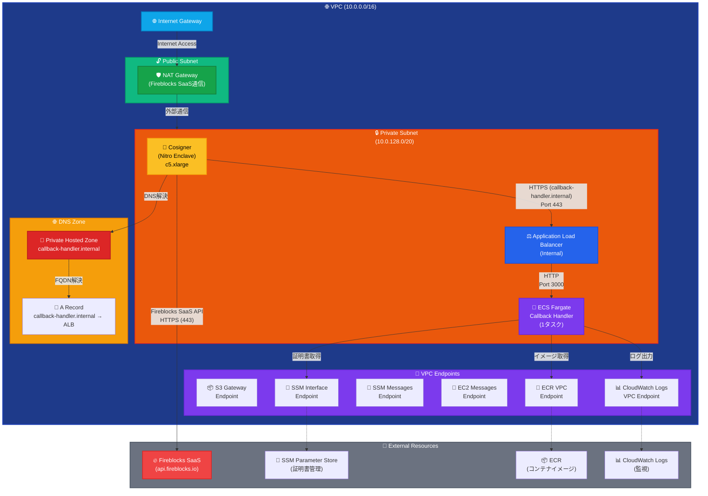
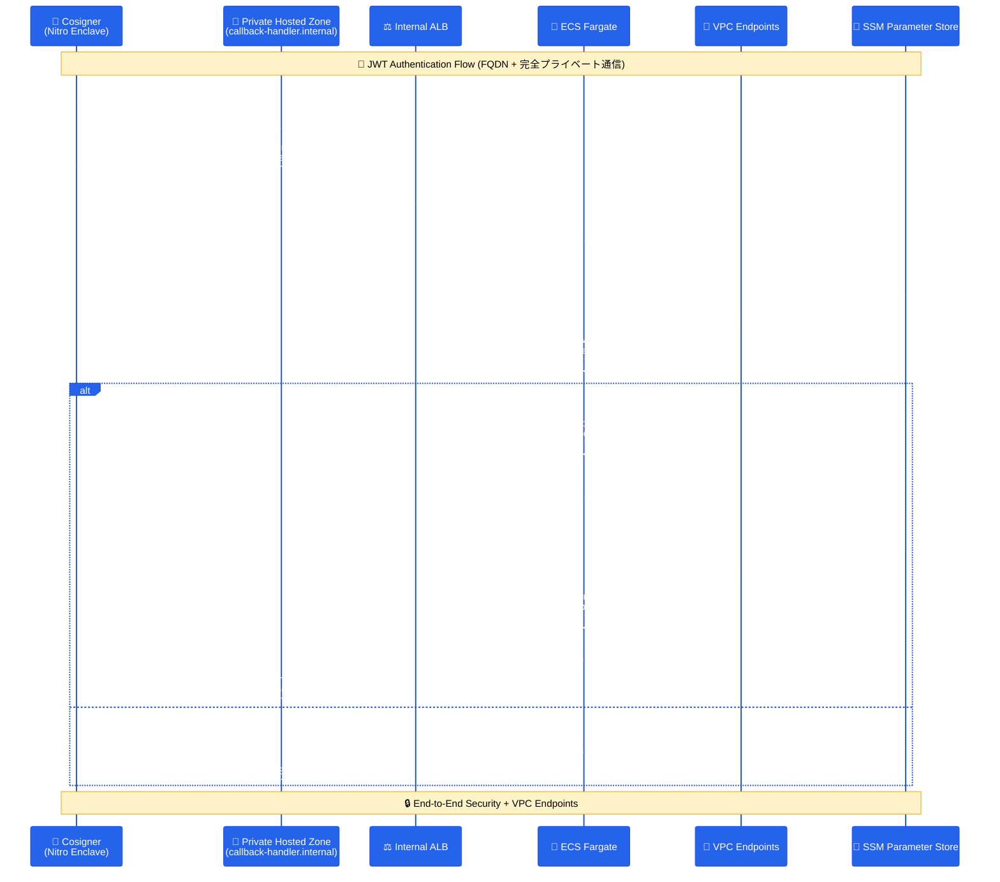

# Fireblocks Callback Handler

Fireblocks Workspace向けのCallback Handlerアプリケーションです。AWS ECS Fargate上でCosignerからのJWT署名要求をセキュアに受信・処理します。

## 📋 概要

このプロジェクトは、Fireblocks CosignerからのHTTPS接続を受け取り、JWT認証による双方向のセキュアな通信を行うCallback Handlerです。AWS ECS Fargate + Application Load Balancer + Private Hosted Zoneの構成で、完全プライベートネットワーク内でのFQDN通信を実現しています。

## 🔥 Fireblocks Cosigner統合の重要性

**Fireblocks Cosignerとは**:
- [Fireblocks公式ドキュメント](https://developers.fireblocks.com/reference/install-api-cosigner-add-new-cosigner-p2)に基づく実装
- API Cosignerは、Fireblocks SaaS (`api.fireblocks.io`) との通信が必要
- JWT-based認証によるセキュアな通信フロー
- Nitro Enclave環境でのハードウェアレベルの分離

**外部通信の必要性**:
- Cosignerは**必ず**Fireblocks SaaSとの通信が必要
- NAT Gatewayを通じた制御された外部アクセス
- 完全プライベートネットワーク内での安全な運用

## 🏗️ アーキテクチャ

### 基本構成（Private Hosted Zone + 外部通信対応）


### 通信フロー図（Private Hosted Zone対応）


## 📦 機能

### 実装済み機能
- **JWT認証**: 双方向の暗号化通信
- **SSM Parameter Store連携**: 証明書の動的取得
- **構造化ログ**: 詳細な監視とトラッキング
- **HTTP/HTTPS対応**: ALBでHTTPS終端
- **ECS Fargate**: 自動スケーリング対応

### 拡張機能（新規追加）
- **Nitro Enclave対応**: Cosignerの安全な実行環境
- **VPC Endpoints**: 完全プライベート通信
- **Session Manager**: セキュアなリモートアクセス
- **セキュリティ強化**: 実環境に基づくセキュリティ設定
- **DNS解決機能**: プライベートホストゾーン対応（オプション）

## 🏗️ インフラストラクチャ拡張

### 新規追加されるAWSリソース

#### ネットワーク構成（実証済み設定）
```yaml
# VPC構成（実際のPoC設定と同じ）
VPC:
  Type: AWS::EC2::VPC
  Properties:
    CidrBlock: 10.0.0.0/16
    EnableDnsHostnames: true
    EnableDnsSupport: true
    Tags:
      - Key: Name
        Value: e2e-monitor-cbh-vpc

# Public Subnet（NAT Gateway用）
PublicSubnet:
  Type: AWS::EC2::Subnet
  Properties:
    VpcId: !Ref VPC
    CidrBlock: 10.0.0.0/20
    AvailabilityZone: !Select [0, !GetAZs '']
    MapPublicIpOnLaunch: true
    Tags:
      - Key: Name
        Value: fireblocks-public-subnet

# Private Subnet（Cosigner + ECS用）
PrivateSubnet:
  Type: AWS::EC2::Subnet
  Properties:
    VpcId: !Ref VPC
    CidrBlock: 10.0.128.0/20
    AvailabilityZone: !Select [0, !GetAZs '']
    MapPublicIpOnLaunch: false
    Tags:
      - Key: Name
        Value: fireblocks-private-subnet

# Internet Gateway
InternetGateway:
  Type: AWS::EC2::InternetGateway
  Properties:
    Tags:
      - Key: Name
        Value: fireblocks-igw

# Internet Gateway Attachment
InternetGatewayAttachment:
  Type: AWS::EC2::VPCGatewayAttachment
  Properties:
    VpcId: !Ref VPC
    InternetGatewayId: !Ref InternetGateway

# NAT Gateway（Fireblocks SaaS通信用）
NATGateway:
  Type: AWS::EC2::NatGateway
  Properties:
    AllocationId: !GetAtt NATGatewayEIP.AllocationId
    SubnetId: !Ref PublicSubnet
    Tags:
      - Key: Name
        Value: fireblocks-nat-gateway

# NAT Gateway用Elastic IP
NATGatewayEIP:
  Type: AWS::EC2::EIP
  DependsOn: InternetGatewayAttachment
  Properties:
    Domain: vpc
    Tags:
      - Key: Name
        Value: fireblocks-nat-eip

# Public Route Table
PublicRouteTable:
  Type: AWS::EC2::RouteTable
  Properties:
    VpcId: !Ref VPC
    Tags:
      - Key: Name
        Value: fireblocks-public-rt

# Public Route（Internet Gateway）
PublicRoute:
  Type: AWS::EC2::Route
  DependsOn: InternetGatewayAttachment
  Properties:
    RouteTableId: !Ref PublicRouteTable
    DestinationCidrBlock: 0.0.0.0/0
    GatewayId: !Ref InternetGateway

# Public Subnet Route Table Association
PublicSubnetRouteTableAssociation:
  Type: AWS::EC2::SubnetRouteTableAssociation
  Properties:
    SubnetId: !Ref PublicSubnet
    RouteTableId: !Ref PublicRouteTable

# Private Route Table
PrivateRouteTable:
  Type: AWS::EC2::RouteTable
  Properties:
    VpcId: !Ref VPC
    Tags:
      - Key: Name
        Value: fireblocks-private-rt

# Private Route（NAT Gateway）
PrivateRoute:
  Type: AWS::EC2::Route
  Properties:
    RouteTableId: !Ref PrivateRouteTable
    DestinationCidrBlock: 0.0.0.0/0
    NatGatewayId: !Ref NATGateway

# Private Subnet Route Table Association
PrivateSubnetRouteTableAssociation:
  Type: AWS::EC2::SubnetRouteTableAssociation
  Properties:
    SubnetId: !Ref PrivateSubnet
    RouteTableId: !Ref PrivateRouteTable
```

#### Nitro Enclave対応EC2（Cosigner用）
```yaml
CosignerInstance:
  Type: AWS::EC2::Instance
  Properties:
    InstanceType: c5.xlarge  # Nitro Enclave対応
    ImageId: ami-03598bf9d15814511  # Amazon Linux 2023
    SubnetId: !Ref PrivateSubnet
    SecurityGroupIds:
      - !Ref CosignerSecurityGroup
    IamInstanceProfile: !Ref CosignerInstanceProfile
    UserData:
      Fn::Base64: !Sub |
        #!/bin/bash
        yum update -y
        yum install -y amazon-ssm-agent
        systemctl enable amazon-ssm-agent
        systemctl start amazon-ssm-agent
        # Nitro Enclave設定
        amazon-linux-extras install aws-nitro-enclaves-cli
        usermod -aG ne ec2-user
        systemctl enable nitro-enclaves-allocator.service
        systemctl start nitro-enclaves-allocator.service
    EnclaveOptions:
      Enabled: true
    Tags:
      - Key: Name
        Value: fireblocks-cosigner
```

#### VPC Endpoints（完全プライベート通信）
```yaml
# S3 Gateway Endpoint（実証済み設定）
S3GatewayEndpoint:
  Type: AWS::EC2::VPCEndpoint
  Properties:
    VpcId: !Ref VPC
    ServiceName: !Sub 'com.amazonaws.${AWS::Region}.s3'
    VpcEndpointType: Gateway
    RouteTableIds:
      - !Ref PrivateRouteTable

# SSM Interface Endpoint（Session Manager用）
SSMEndpoint:
  Type: AWS::EC2::VPCEndpoint
  Properties:
    VpcId: !Ref VPC
    ServiceName: !Sub 'com.amazonaws.${AWS::Region}.ssm'
    VpcEndpointType: Interface
    SubnetIds:
      - !Ref PrivateSubnet
    SecurityGroupIds:
      - !Ref VPCEndpointSecurityGroup
    PrivateDnsEnabled: true
    PolicyDocument:
      Version: '2012-10-17'
      Statement:
        - Effect: Allow
          Principal: '*'
          Action: 'ssm:*'
          Resource: '*'

# SSM Messages Endpoint（Session Manager用）
SSMMessagesEndpoint:
  Type: AWS::EC2::VPCEndpoint
  Properties:
    VpcId: !Ref VPC
    ServiceName: !Sub 'com.amazonaws.${AWS::Region}.ssmmessages'
    VpcEndpointType: Interface
    SubnetIds:
      - !Ref PrivateSubnet
    SecurityGroupIds:
      - !Ref VPCEndpointSecurityGroup
    PrivateDnsEnabled: true

# EC2 Messages Endpoint（Session Manager用）
EC2MessagesEndpoint:
  Type: AWS::EC2::VPCEndpoint
  Properties:
    VpcId: !Ref VPC
    ServiceName: !Sub 'com.amazonaws.${AWS::Region}.ec2messages'
    VpcEndpointType: Interface
    SubnetIds:
      - !Ref PrivateSubnet
    SecurityGroupIds:
      - !Ref VPCEndpointSecurityGroup
    PrivateDnsEnabled: true

# ECR VPC Endpoint（コンテナイメージ取得用）
ECREndpoint:
  Type: AWS::EC2::VPCEndpoint
  Properties:
    VpcId: !Ref VPC
    ServiceName: !Sub 'com.amazonaws.${AWS::Region}.ecr.dkr'
    VpcEndpointType: Interface
    SubnetIds:
      - !Ref PrivateSubnet
    SecurityGroupIds:
      - !Ref VPCEndpointSecurityGroup
    PrivateDnsEnabled: true

# CloudWatch Logs VPC Endpoint
CloudWatchLogsEndpoint:
  Type: AWS::EC2::VPCEndpoint
  Properties:
    VpcId: !Ref VPC
    ServiceName: !Sub 'com.amazonaws.${AWS::Region}.logs'
    VpcEndpointType: Interface
    SubnetIds:
      - !Ref PrivateSubnet
    SecurityGroupIds:
      - !Ref VPCEndpointSecurityGroup
    PrivateDnsEnabled: true

# EC2 Messages VPC Endpoint
EC2MessagesEndpoint:
  Type: AWS::EC2::VPCEndpoint
  Properties:
    VpcId: !Ref VPC
    ServiceName: !Sub 'com.amazonaws.${AWS::Region}.ec2messages'
    VpcEndpointType: Interface
    SubnetIds:
      - !Ref PrivateSubnetA
    SecurityGroupIds:
      - !Ref VPCEndpointSecurityGroup
    PrivateDnsEnabled: true

# S3 Gateway Endpoint
S3Endpoint:
  Type: AWS::EC2::VPCEndpoint
  Properties:
    VpcId: !Ref VPC
    ServiceName: !Sub 'com.amazonaws.${AWS::Region}.s3'
    VpcEndpointType: Gateway
    RouteTableIds:
      - !Ref PrivateRouteTable
```

#### Private Hosted Zone（FQDN通信）
```yaml
# Private Hosted Zone
PrivateHostedZone:
  Type: AWS::Route53::HostedZone
  Properties:
    Name: callback-handler.internal
    VPCs:
      - VPCId: !Ref VPC
        VPCRegion: !Ref AWS::Region
    HostedZoneConfig:
      Comment: 'Private hosted zone for Fireblocks callback handler'
    HostedZoneTags:
      - Key: Name
        Value: callback-handler-internal-zone
      - Key: Environment
        Value: production

# ALB DNS Record
CallbackHandlerARecord:
  Type: AWS::Route53::RecordSet
  Properties:
    HostedZoneId: !Ref PrivateHostedZone
    Name: callback-handler.internal
    Type: A
    AliasTarget:
      DNSName: !GetAtt ApplicationLoadBalancer.DNSName
      HostedZoneId: !GetAtt ApplicationLoadBalancer.CanonicalHostedZoneID
      EvaluateTargetHealth: true
    Comment: 'A record pointing to ALB for callback handler'
```

#### IAM Role（Session Manager + Nitro Enclave）
```yaml
CosignerRole:
  Type: AWS::IAM::Role
  Properties:
    AssumeRolePolicyDocument:
      Version: '2012-10-17'
      Statement:
        - Effect: Allow
          Principal:
            Service: ec2.amazonaws.com
          Action: sts:AssumeRole
    ManagedPolicyArns:
      - arn:aws:iam::aws:policy/AmazonSSMManagedInstanceCore
    Policies:
      - PolicyName: CosignerPolicy
        PolicyDocument:
          Version: '2012-10-17'
          Statement:
            - Effect: Allow
              Action:
                - ssm:GetParameter
                - ssm:GetParameters
                - ssm:GetParametersByPath
              Resource: !Sub 'arn:aws:ssm:${AWS::Region}:${AWS::AccountId}:parameter/fireblocks-callback-infrastructure/*'
            - Effect: Allow
              Action:
                - kms:Decrypt
              Resource: !Sub 'arn:aws:kms:${AWS::Region}:${AWS::AccountId}:key/*'
            - Effect: Allow
              Action:
                - logs:CreateLogGroup
                - logs:CreateLogStream
                - logs:PutLogEvents
              Resource: !Sub 'arn:aws:logs:${AWS::Region}:${AWS::AccountId}:log-group:/aws/ec2/cosigner*'
```

#### セキュリティグループ強化（実証済み設定）
```yaml
# Cosigner用セキュリティグループ
CosignerSecurityGroup:
  Type: AWS::EC2::SecurityGroup
  Properties:
    GroupDescription: Security group for Cosigner (Nitro Enclave)
    VpcId: !Ref VPC
    SecurityGroupEgress:
      # ALBへのHTTPS通信
      - IpProtocol: tcp
        FromPort: 443
        ToPort: 443
        DestinationSecurityGroupId: !Ref ALBSecurityGroup
        Description: 'HTTPS to ALB'
      # VPCエンドポイントへの通信
      - IpProtocol: tcp
        FromPort: 443
        ToPort: 443
        DestinationSecurityGroupId: !Ref VPCEndpointSecurityGroup
        Description: 'HTTPS to VPC Endpoints'
      # Fireblocks SaaS API通信（NAT Gateway経由）
      - IpProtocol: tcp
        FromPort: 443
        ToPort: 443
        CidrIp: 0.0.0.0/0
        Description: 'HTTPS to Fireblocks SaaS API'
    Tags:
      - Key: Name
        Value: cosigner-sg

# ALB用セキュリティグループ
ALBSecurityGroup:
  Type: AWS::EC2::SecurityGroup
  Properties:
    GroupDescription: Security group for Application Load Balancer
    VpcId: !Ref VPC
    SecurityGroupIngress:
      - IpProtocol: tcp
        FromPort: 443
        ToPort: 443
        SourceSecurityGroupId: !Ref CosignerSecurityGroup
        Description: 'HTTPS from Cosigner'
    SecurityGroupEgress:
      - IpProtocol: tcp
        FromPort: 3000
        ToPort: 3000
        DestinationSecurityGroupId: !Ref ECSSecurityGroup
        Description: 'HTTP to ECS'
    Tags:
      - Key: Name
        Value: alb-sg

# VPCエンドポイント用セキュリティグループ
VPCEndpointSecurityGroup:
  Type: AWS::EC2::SecurityGroup
  Properties:
    GroupDescription: Security group for VPC Endpoints
    VpcId: !Ref VPC
    SecurityGroupIngress:
      - IpProtocol: tcp
        FromPort: 443
        ToPort: 443
        SourceSecurityGroupId: !Ref CosignerSecurityGroup
        Description: 'HTTPS from Cosigner'
      - IpProtocol: tcp
        FromPort: 443
        ToPort: 443
        SourceSecurityGroupId: !Ref ECSSecurityGroup
        Description: 'HTTPS from ECS'
    Tags:
      - Key: Name
        Value: vpc-endpoint-sg

# ECS用セキュリティグループ
ECSSecurityGroup:
  Type: AWS::EC2::SecurityGroup
  Properties:
    GroupDescription: Security group for ECS Fargate
    VpcId: !Ref VPC
    SecurityGroupIngress:
      - IpProtocol: tcp
        FromPort: 3000
        ToPort: 3000
        SourceSecurityGroupId: !Ref ALBSecurityGroup
        Description: 'HTTP from ALB'
    SecurityGroupEgress:
      - IpProtocol: tcp
        FromPort: 443
        ToPort: 443
        DestinationSecurityGroupId: !Ref VPCEndpointSecurityGroup
        Description: 'HTTPS to VPC Endpoints'
    Tags:
      - Key: Name
        Value: ecs-sg
```

## 📁 プロジェクト構造

```
e2e-monitor-cbh/
├── README.md                        # プロジェクト概要
├── .gitignore                       # Git除外設定
├── app/                             # アプリケーション
│   ├── src/                         # ソースコード
│   │   ├── app.js                  # メインアプリケーション（既存）
│   │   ├── logger.js               # ログシステム（既存）
│   │   ├── jwtHandler.js           # JWT処理モジュール（既存）
│   │   ├── modules/                # 新規モジュール
│   │   │   ├── dnsHandler.js       # DNS解決機能（オプション）
│   │   │   └── metricsHandler.js   # メトリクス収集
│   │   └── package.json            # Node.js依存関係
│   ├── Dockerfile                  # ECS Fargate用Dockerfile（既存）
│   ├── tests/                      # テストコード
│   └── certs/                      # 証明書ディレクトリ
│       ├── .gitkeep               # Git管理用空ファイル
│       ├── cosigner_public.pem    # Cosigner公開鍵（要配置）
│       └── callback_private.pem   # Callback秘密鍵（要配置）
├── infrastructure/                 # AWS インフラストラクチャ
│   ├── cloudformation.yaml        # CloudFormationテンプレート（拡張）
│   ├── templates/                 # 追加テンプレート
│   │   ├── nitro-enclave.yaml     # Nitro Enclave設定
│   │   ├── vpc-endpoints.yaml     # VPC Endpoints設定
│   │   └── dns-integration.yaml   # Private Hosted Zone設定
│   ├── scripts/                   # デプロイメントスクリプト
│   │   ├── validate-env.sh        # 環境検証
│   │   └── post-deploy.sh         # デプロイ後処理
│   └── deploy.sh                  # 自動デプロイスクリプト（拡張）
├── docs/                          # ドキュメント
│   ├── deployment-guide.md        # デプロイメントガイド（既存）
│   ├── aws-deployment-plan.md     # 技術仕様書（既存）
│   ├── guides/                    # 新規ガイド
│   │   ├── nitro-enclave-setup.md # Nitro Enclave設定ガイド
│   │   ├── security-hardening.md  # セキュリティ強化ガイド
│   │   └── troubleshooting.md     # トラブルシューティング
│   └── architecture/              # アーキテクチャ図
├── scripts/                       # ユーティリティスクリプト
│   ├── setup.sh                   # 初期セットアップ（既存）
│   ├── aws/                       # AWS設定スクリプト
│   │   ├── create-certificates.sh # 証明書生成
│   │   └── setup-session-manager.sh # Session Manager設定
│   ├── certificates/              # 証明書管理
│   │   └── generate-certs.sh      # 証明書生成ユーティリティ
│   └── deployment/                # デプロイメント支援
│       ├── health-check.sh        # ヘルスチェック
│       └── rollback.sh            # ロールバック
├── monitoring/                    # 監視設定
│   ├── dashboards/                # CloudWatch Dashboard
│   │   ├── callback-handler.json  # メインダッシュボード
│   │   └── cosigner-metrics.json  # Cosigner監視
│   └── alarms/                    # CloudWatch Alarms
│       ├── ecs-alarms.yaml        # ECS関連アラーム
│       └── security-alarms.yaml   # セキュリティアラーム
└── security/                      # セキュリティ設定
    ├── policies/                  # IAM Policy
    │   ├── cosigner-policy.json    # Cosigner用IAM Policy
    │   └── ecs-policy.json         # ECS用IAM Policy
    └── roles/                     # IAM Role
        ├── cosigner-role.yaml      # Cosigner用IAM Role
        └── ecs-role.yaml           # ECS用IAM Role
```

## 🚀 クイックスタート

### 開発環境のセットアップ

#### オプション1: DevContainer使用（推奨）

```bash
# 1. VS Codeでプロジェクトを開く
code .

# 2. DevContainerで再オープン
# Command Palette (Ctrl+Shift+P) → "Dev Containers: Reopen in Container"
```

DevContainerには以下が自動で含まれます：
- AWS CLI
- jq (JSON processor)
- yq (YAML processor)
- Node.js 22
- Docker
- 必要なVS Code拡張機能

#### オプション2: ローカル環境セットアップ

##### 前提条件

- AWS CLI (設定済み)
- Docker
- jq (JSON processor)
- Node.js 22+
- 適切なAWS権限

```bash
# jqのインストール (Ubuntu/Debian)
sudo apt install jq

# jqのインストール (macOS)
brew install jq
```

### 1. 証明書の準備

```bash
# 証明書ファイルを配置
cp cosigner_public.pem app/certs/
cp callback_private.pem app/certs/
```

### 2. 環境設定

```bash
# AWS認証情報の設定
aws configure --profile dev_mtools

# プロジェクト設定の確認
cat infrastructure/parameters/common.json
```

### 3. 環境のデプロイメント

```bash
# 設定状況の確認
./infrastructure/deploy-stacks.sh status

# 全スタックのデプロイ
./infrastructure/deploy-stacks.sh deploy-all

# 特定の環境でのデプロイ
./infrastructure/deploy-stacks.sh deploy-all -e prod

# ヘルプの表示
./infrastructure/deploy-stacks.sh help
```

### 3. Cosignerの設定

```bash
# Cosignerインスタンスへのアクセス（Session Manager経由）
aws ssm start-session --target i-xxxxxxxxx --region ap-northeast-1

# Cosignerソフトウェアのインストール
sudo yum update -y
# Fireblocks Cosignerインストール手順...
```

### 4. 設定確認

```bash
# ヘルスチェック
curl -k https://your-alb-dns-name.elb.amazonaws.com/health

# JWT通信テスト
curl -k -X POST https://your-alb-dns-name.elb.amazonaws.com/v2/tx_sign_request \
  -H "Content-Type: application/json" \
  -d "your-jwt-token"
```

## 📊 監視・運用

### ログ確認

```bash
# ECS Fargate ログ
aws logs tail /ecs/callback-handler --follow --region ap-northeast-1

# Cosigner EC2 ログ
aws logs tail /aws/ec2/cosigner --follow --region ap-northeast-1
```

### メトリクス確認

```bash
# ECS Service 状態
aws ecs describe-services --cluster fireblocks-callback-cluster --services callback-handler-service

# Cosigner インスタンス状態
aws ec2 describe-instances --instance-ids i-xxxxxxxxx --query 'Reservations[0].Instances[0].State'
```

## 💰 コスト

### 基本構成
月額約$54（東京リージョン）

- ECS Fargate (1タスク): $18
- Application Load Balancer: $20
- VPC Endpoints: $10
- CloudWatch Logs: $5
- 管理費用: $1

### 拡張構成（Nitro Enclave含む）
月額約$95（東京リージョン）

- **基本構成**: $54
- **Cosigner EC2 (c5.xlarge)**: $35
- **追加VPC Endpoints**: $6
- **Private Hosted Zone**: $0.50 (DNS Zone) + $0.40 (per million queries)
- **NAT Gateway**: $32 (1 NAT Gateway) + $0.045/GB (データ転送)
- **Elastic IP**: $3.65 (NAT Gateway用)

**月間推定総額**: $131.15 + データ転送費用

### コスト最適化
- **Spot Instance**: Cosigner用EC2でSpotを使用し約50%削減
- **予約インスタンス**: 長期運用時の大幅削減
- **Auto Scaling**: 需要に応じた自動調整

## 🔒 セキュリティ

### セキュリティ強化機能
- **Nitro Enclave**: ハードウェアレベルの分離
- **VPC Endpoints**: 完全プライベート通信
- **Session Manager**: SSH鍵不要のセキュアアクセス
- **IAM最小権限**: 必要最小限の権限設定
- **CloudTrail**: 全API操作の監査ログ
- **NAT Gateway**: 外部通信の制御されたアクセス（Fireblocks SaaS API）
- **セキュリティグループ**: 最小権限による通信制御

### セキュリティ監視
- **CloudWatch Alarms**: 異常検知
- **AWS Config**: 設定変更監視
- **Security Hub**: 包括的セキュリティ状況

## 🤝 コントリビューション

1. フォークしてください
2. 機能ブランチを作成 (`git checkout -b feature/NitroEnclaveSupport`)
3. 変更をコミット (`git commit -m 'Add Nitro Enclave support'`)
4. ブランチにプッシュ (`git push origin feature/NitroEnclaveSupport`)
5. プルリクエストを作成

## 📄 ライセンス

MIT License

## 📞 サポート

問題が発生した場合は、以下の情報を含めてIssueを作成してください：

- エラーメッセージ
- CloudWatch Logsの出力
- 実行した手順
- 環境情報
- Cosignerの設定情報

## 🔄 バージョン履歴

- **v1.2.0** - 拡張版 (開発中)
  - Nitro Enclave対応
  - VPC Endpoints統合
  - Session Manager対応
  - セキュリティ強化
  - Private Hosted Zone対応（FQDN通信）

- **v1.1.0** - 最適化版 (現在)
  - 2層構成への最適化
  - 1タスク構成の採用
  - 約30%のコスト削減
  - 管理の簡素化

- **v1.0.0** - 初期リリース
  - ECS Fargate対応
  - プライベートネットワーク構成
  - JWT認証実装

---

**注意**: この拡張版では、実際のProduction環境での運用を想定したセキュリティ強化とNitro Enclave対応が含まれています。開発環境では適切にフラグを設定してください。

## 🛡️ 実運用における重要なポイント

### Fireblocks Cosignerとの通信要件
1. **外部通信の必要性**: CosignerはFireblocks SaaSとの通信が必須
2. **NAT Gateway**: Private subnetからの制御された外部アクセス
3. **セキュリティグループ**: 最小権限による通信制御

### デプロイメント時の確認事項
1. **VPC設定**: 既存VPC `vpc-04f05a7bca5f73400` の設定を参考
2. **Subnet構成**: Public (10.0.0.0/20) + Private (10.0.128.0/20)
3. **Route Table**: Private → NAT Gateway → Internet Gateway
4. **DNS設定**: Private Hosted Zone for FQDN communication

### 検証済みの設定
- **VPC CIDR**: 10.0.0.0/16
- **Public Subnet**: 10.0.0.0/20 (NAT Gateway用)
- **Private Subnet**: 10.0.128.0/20 (Cosigner + ECS用)
- **VPC Endpoints**: S3, SSM, SSMMessages, EC2Messages 