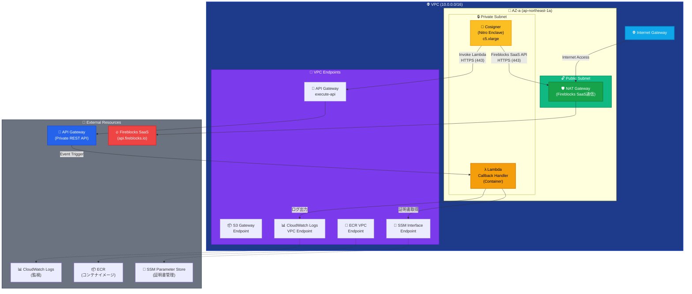
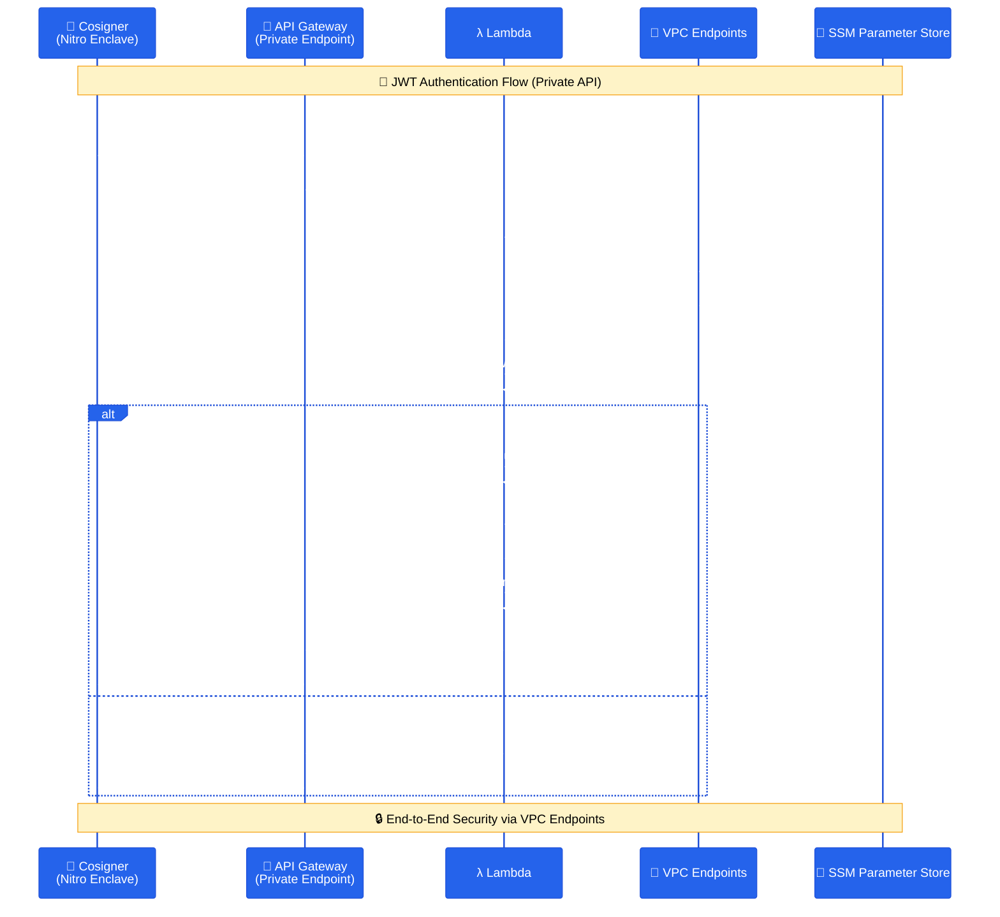

# Fireblocks Callback Handler

Fireblocks Workspace向けのCallback Handlerアプリケーションです。AWS Lambda (コンテナイメージ) と API Gateway Private API を利用し、CosignerからのJWT署名要求をセキュアかつサーバーレスに受信・処理します。

## 📋 概要

このプロジェクトは、Fireblocks CosignerからのHTTPS接続を **API Gateway Private API** で受け取り、**AWS Lambda (コンテナ)** でJWT認証とビジネスロジックを実行するCallback Handlerです。VPC Endpoint を経由した完全プライベートネットワーク通信を実現します。

## 🔥 Fireblocks Cosigner統合の重要性

**Fireblocks Cosignerとは**:
- [Fireblocks公式ドキュメント](https://developers.fireblocks.com/reference/install-api-cosigner-add-new-cosigner-p2)に基づく実装
- API Cosignerは、Fireblocks SaaS (`api.fireblocks.io`) との通信が必要
- JWT-based認証によるセキュアな通信フロー
- Nitro Enclave環境でのハードウェアレベルの分離

**外部通信の必要性**:
- Cosignerは**必ず**Fireblocks SaaSとの通信が必要
- NAT Gatewayを通じた制御された外部アクセス
- 完全プライベートネットワーク内での安全な運用

## 🏗️ アーキテクチャ

### Lambda + API Gateway 構成（シングルAZ + 外部通信対応）


### 通信フロー図（API Gateway Private Endpoint）


## 🏗️ 設計要点

### マルチスタックアーキテクチャ
このプロジェクトは、**4つの独立したCloudFormationスタック**で構成されています：

1.  **Foundation Stack** (`01-foundation.yaml`) - VPC、サブネット、ルーティング
2.  **Security Stack** (`02-security.yaml`) - IAM、セキュリティグループ、KMS、VPC Endpoints
3.  **CodeBuild + ECR Automation** (`03-codebuild-automation.yaml`) - ECRリポジトリ + Dockerイメージ自動ビルド
4.  **Lambda Callback Stack** (`04-lambda-callback.yaml`) - API Gateway + Lambda
5.  **Cosigner Stack** (`05-cosigner.yaml`) - EC2, S3, Nitro Enclave

### ネットワーク設計
- **VPC**: 10.0.0.0/16 (完全プライベート)
- **シングルAZ**: コストを優先したシンプルな構成（必要に応じてマルチAZ化も可能）
- **外部通信**: CosignerからFireblocks SaaSへはNAT Gateway経由でアクセス

### セキュリティ設計
- **Nitro Enclave**: ハードウェアレベルの分離
- **VPC Endpoints**: 完全プライベート通信
- **KMS Customer Managed Key**: 専用暗号化
- **IAM最小権限**: 必要最小限の権限設定
- **Session Manager**: SSH鍵不要のセキュアアクセス

## 📦 機能

### JWT認証
- Cosignerからの署名付きJWT受信
- 公開鍵による署名検証
- 秘密鍵による応答JWT生成

### 証明書管理
- SSM Parameter Storeによる動的証明書取得
- KMS暗号化による保護
- VPC Endpoints経由のセキュアアクセス

### 監視・ログ
- CloudWatch Logsによる構造化ログ
- Lambda メトリクス
- セキュリティイベント監視

## 📁 プロジェクト構造

```
fireblocks-callback-handler/
├── README.md                        # プロジェクト概要
├── STACK_DEPLOYMENT_GUIDE.md        # デプロイメントガイド
├── app/                             # アプリケーション
│   ├── src/                         # ソースコード
│   └── Dockerfile                   # Lambda Container Image用
├── infrastructure/                  # インフラストラクチャ
│   ├── deploy-automated.sh         # 🚀 完全自動化デプロイスクリプト
│   ├── stacks/                     # CloudFormationスタック
│   │   ├── 01-foundation.yaml      # ネットワーク基盤
│   │   ├── 02-security.yaml        # セキュリティ設定 + SSL証明書インポート
│   │   ├── 03-codebuild-automation.yaml # CodeBuild + ECR自動ビルド
│   │   ├── 04-lambda-callback.yaml # Lambda + API Gateway
│   │   └── 05-cosigner.yaml        # Cosigner設定
│   └── parameters/                 # パラメータファイル
│       ├── common.json             # 📝 共通設定（自動生成の基盤）
│       ├── dev/                    # 開発環境（common.jsonから自動生成）
│       └── production-jp/          # 本番環境（common.jsonから自動生成）
└── .devcontainer/                   # DevContainer設定
```

## 🚀 クイックスタート

### 方法1: 自動デプロイメント（推奨）

#### 事前準備（必須）

```bash
# DevContainerで開発環境を起動
code .
# Command Palette → "Dev Containers: Reopen in Container"


# 1. パラメータファイルを作成
# common.json を編集
vi infrastructure/parameters/common.json

# ProjectName, Environment, Region を編集
# ProjectName: プロジェクト名
# Environment: 環境 (dev, staging, prod, cm)
# Region: リージョン (ap-northeast-1)


# 各スタックに必要なパラメータファイル群が自動生成されます
./infrastructure/create-parameters.sh

# 2. JWT証明書を準備（Cosigner公開鍵は後で）
# certs/ ディレクトリを作成
mkdir -p certs && cd certs

# Callback Handler用の秘密鍵・公開鍵を生成
openssl genrsa -out callback_private.pem 2048
openssl rsa -in callback_private.pem -outform PEM -pubout -out callback_public.pem

# Cosignerの公開鍵（cosigner_public.pem）は、全スタックのデプロイと
# 「5. Cosignerの手動設定」完了後に取得できるため、この段階では不要です。

cd ..
```

#### 自動デプロイメント

```bash
# インフラ全スタックのデプロイ（callback鍵は自動登録・cosigner鍵は後で手動）
./infrastructure/deploy-automated.sh -p <aws_profile>
```

**含まれる自動化**:
- 📝 **事前のパラメータファイル作成**（`./infrastructure/create-parameters.sh`）
- 🏗️ CloudFormationスタックの依存関係順デプロイ (4スタック)
- 📦 ECRリポジトリの作成
- 🔨 CodeBuildによるDockerイメージの自動ビルド・プッシュ
- 🚀 API Gateway (Private) と Lambda関数のデプロイ
- 🔄 CodeBuild完了後、自動でLambda関数を最新イメージに更新
- 👤 Cosigner EC2インスタンスの準備

**実行例**:
```bash
# ⚠️ 事前準備が必要（上記の事前準備手順を完了してください）

# 1. パラメータファイルを作成
./infrastructure/create-parameters.sh

# 2. フルデプロイ
./infrastructure/deploy-automated.sh -p <aws_profile>
```

#### EC2(cosigner)へのSSH over Session Manager設定例(windowsマシン) `~/.ssh/config`

```
Host AWS-e2e-monitor-cbh-cosigner-dev
    ProxyCommand C:\Windows\System32\cmd.exe /c "aws ssm start-session --target %h --document-name AWS-StartSSHSession --profile <aws_profile>"
    HostName i-xxxxxxxxxx
    User ec2-user
    IdentityFile C:\Users\<user_name>\.ssh\cosigner_ssh_key_dev.pem
```

aws_profileは、windowsマシンのaws cliの設定ファイル `C:\Users\<user_name>\.aws\config`(例) に設定されている必要がある。


### 5. Cosignerの手動設定

CosignerマシンにSSH接続し、以下の手順でCosignerソフトウェアをインストール

```bash
# Cosignerソフトウェアのインストール
sudo yum update -y

# Fireblocks提供のCosignerインストール手順に従う
# wgetでスクリプトをダウンロード(URLはfireblocks cosignerセットアップコンソールから取得)

wget -O nitro-cosigner.tar.gz "<cosigner_install_script_url>"
tar -xzvf nitro-cosigner.tar.gz

# スクリプトでCo-Signerインストール

sudo ./install.sh

- ペアリングトークンをコピペ

  (fireblocks cosignerセットアップコンソールから取得)

- S3 bucket nameを入力

  例：e2e-monitor-cbh-cosigner-stg-123456789012

- KMSのARNを入力

  例：arn:aws:kms:ap-northeast-1:123456789012:key/xxxxxxxxx

```

callback handlerを設定する場合

```bash

- callback URLを入力

　例：https://xxxxxxxxxx.execute-api.ap-northeast-1.amazonaws.com/prod/callback

- callback public keyを入力

　(certs/callback_public.pemの内容をコピペ)


```

#### cosigner_public.pemを取得

##### 1.Cosignerマシン

```bash
# cosigner_public.pemを出力
sudo cosigner print-public-key
```

出力をメモして手元のcerts/cosigner_public.pemに保存

##### 2.操作端末(this repository)

SSM Parameter Storeへ手動登録

```bash
# Cosigner の公開鍵（Cosignerセットアップ後）
aws ssm put-parameter \
  --name "/e2e-monitor-cbh/<env>/jwt/cosigner-public-key" \
  --description "JWT Cosigner Public Key" \
  --value "file://certs/cosigner_public.pem" \
  --type "SecureString" \
  --overwrite \
  --region ap-northeast-1 \
  --profile <aws_profile>
```


#### Cosignerログローテーション設定の変更（インストール後）

Cosigner インストール後に、ログのローテーションポリシー（世代数や保持期間など）を変更したい場合は、`logrotate` の設定ファイルを編集します。

```bash
# root 権限で customer_cosigner の logrotate 設定を編集
sudo vi /etc/logrotate.d/customer_cosigner
```

例えば、ローテーション世代数を 10 → 100 に増やしたい場合は、以下のように `rotate` の値を変更します。

```diff
-    size 10M
-    rotate 10
+    size 10M
+    rotate 100
```

必要に応じて、最大保持日数 (`maxage`) なども同じファイルに追記できます。

```bash
maxage 365
```

設定内容を反映する前に、Dry-Run で内容を確認したい場合は以下を実行します（任意）。

```bash
sudo logrotate -d /etc/logrotate.conf
```

これで、Cosigner ログのローテーション設定は `/etc/logrotate.d/customer_cosigner` を編集するだけで変更できます。


# その他実行オプション

```
# 途中で失敗した場合の再実行（codebuildスタックから）
./infrastructure/deploy-automated.sh -p <aws_profile> --from-stack codebuild

# 特定のスタックのみ実行（例：Lambda）
./infrastructure/deploy-automated.sh -p <aws_profile> --only-stacks lambda

# 特定のスタックをスキップ（例：Cosigner）
./infrastructure/deploy-automated.sh -p <aws_profile> --skip-stacks cosigner

# ドライランで実行内容を事前確認
./infrastructure/deploy-automated.sh -p <aws_profile> --dry-run

# 現在のスタック状態を確認
./infrastructure/deploy-automated.sh -p <aws_profile> --status
```

### 🛠️ 高度なデプロイメント機能

#### 1. スタック状態の確認
```bash
# 現在のスタック状態を確認
./infrastructure/deploy-automated.sh -p <aws_profile> --status

# 出力例：
# 📊 Stack Status Summary (Environment: dev)
# =================================================
#   ✅ 1️⃣ Foundation (VPC, Subnets): CREATE_COMPLETE
#       Stack: e2e-monitor-cbh-01-foundation-dev
#   ❌ 2️⃣ Security (IAM, Security Groups): CREATE_FAILED
#       Stack: e2e-monitor-cbh-02-security-dev
#   ⚪ 3️⃣ CodeBuild + ECR: Not deployed
#       Stack: e2e-monitor-cbh-03-codebuild-dev
#   ⚪ 4️⃣ Lambda Callback: Not deployed
#       Stack: e2e-monitor-cbh-04-lambda-callback-dev
#   ⚪ 5️⃣ Cosigner (EC2, Nitro Enclave): Not deployed
#       Stack: e2e-monitor-cbh-05-cosigner-dev
```

#### 2. 途中からの再実行（失敗時のリベンジ）
```bash
# 特定のスタックから再開
./infrastructure/deploy-automated.sh -p <aws_profile> --from-stack codebuild

# 利用可能なスタック名:
# - foundation: VPC、サブネット
# - security: IAM、セキュリティグループ
# - codebuild: CodeBuild + ECR
# - lambda: Lambda Callback Handler
# - cosigner: Cosigner EC2
```

#### 3. 特定スタックのみ実行
```bash
# 単一スタックのみ実行
./infrastructure/deploy-automated.sh -p <aws_profile> --only-stacks lambda

# 複数スタックのみ実行（カンマ区切り）
./infrastructure/deploy-automated.sh -p <aws_profile> --only-stacks security,lambda

# 利用可能なスタック名: foundation, security, codebuild, lambda, cosigner
```

#### 4. 特定スタックのスキップ
```bash
# 単一スタックをスキップ
./infrastructure/deploy-automated.sh -p <aws_profile> --skip-stacks cosigner

# 複数スタックをスキップ（カンマ区切り）
./infrastructure/deploy-automated.sh -p <aws_profile> --skip-stacks cosigner,codebuild
```

#### 5. ドライランモード
```bash
# 実際にデプロイせずに実行内容を確認
./infrastructure/deploy-automated.sh -p <aws_profile> --dry-run
```

#### 6. 環境別・地域別デプロイメント
```bash
# 開発環境（デフォルト）
./infrastructure/deploy-automated.sh -p dev_profile

# ステージング環境
./infrastructure/deploy-automated.sh -p staging_profile -e staging

# 本番環境
./infrastructure/deploy-automated.sh -p prod_profile -e prod

# 異なるリージョンにデプロイ
./infrastructure/deploy-automated.sh -p my_profile -r us-east-1
```

### 🔧 トラブルシューティング

#### よくある失敗パターンと対処法

1. **JWT証明書が見つからない（デプロイ前エラー）**
   ```bash
   # JWT証明書を生成してから再実行
   mkdir -p certs && cd certs
   openssl genrsa -out callback_private.pem 2048
   openssl rsa -in callback_private.pem -outform PEM -pubout -out callback_public.pem
   # cosigner_public.pem は Cosignerセットアップ完了後に取得（この時点では不要）
   cd .. && ./infrastructure/deploy-automated.sh -p <aws_profile>
   ```

2. **CodeBuildでのイメージビルド失敗**
   ```bash
   # CodeBuildスタックから再実行
   ./infrastructure/deploy-automated.sh -p <aws_profile> --from-stack codebuild
   ```

3. **Lambda関数でのコンテナ起動失敗**
   ```bash
   # Lambda Callbackスタックから再実行
   ./infrastructure/deploy-automated.sh -p <aws_profile> --from-stack lambda
   ```

4. **Cosignerが不要な場合**
   ```bash
   # Cosignerをスキップしてデプロイ
   ./infrastructure/deploy-automated.sh -p <aws_profile> --skip-stacks cosigner
   ```

#### エラー時の状態確認
```bash
# 詳細な状態確認
./infrastructure/deploy-automated.sh -p <aws_profile> --status

# JWT証明書ファイルの確認
ls -la certs/
# 以下のファイルが必要（段階により異なる）:
# - callback_private.pem  (自動生成)
# - callback_public.pem   (自動生成)
# - cosigner_public.pem   (Cosignerセットアップ完了後に取得)

# SSM Parameter Store の確認
aws ssm get-parameters \
    --names "/e2e-monitor-cbh/dev/jwt/callback-private-key" \
           "/e2e-monitor-cbh/dev/jwt/cosigner-public-key" \
    --region ap-northeast-1 \
    --profile <aws_profile> \
    --query 'Parameters[].Name'

# AWS コンソールでの確認
# 1. CloudFormation スタックの詳細
# 2. CloudWatch Logs でのログ確認
# 3. Lambda 関数の状態確認
# 4. SSM Parameter Store での証明書確認
```


## 💰 コスト

### 月額推定コスト（東京リージョン）
- **Lambda**: $5-10 (実行時間による)
- **API Gateway**: $3 (Private API)
- **Cosigner EC2 (c5.xlarge)**: $35
- **NAT Gateway**: $32
- **VPC Endpoints**: $16
- **その他**: $10

**合計**: 約$101-106/月

### コスト最適化
- Spot Instance使用でEC2コストを約50%削減
- 予約インスタンスで長期運用コスト削減
- Lambdaの自動スケーリングにより従量課金

## 🔒 セキュリティ

### セキュリティ機能
- **Nitro Enclave**: ハードウェアレベルの分離
- **KMS暗号化**: 専用Customer Managed Key
- **VPC Endpoints**: 完全プライベート通信
- **IAM最小権限**: 必要最小限の権限
- **Session Manager**: SSH鍵不要のアクセス

### 監視・監査
- **CloudWatch Alarms**: 異常検知
- **CloudTrail**: API操作監査
- **Security Hub**: セキュリティ状況
- **AWS Config**: 設定変更監視

## 🔄 バージョン履歴

- **v3.0.0** - Lambda専用版（現在）
  - Lambda Container Image対応
  - API Gateway Private REST API
  - Nitro Enclave対応
  - 完全サーバーレス構成

- **v2.0.0** - マルチスタック対応版
  - 5スタック構成
  - ECS Fargate + Lambda 両対応
  - Private Hosted Zone対応

- **v1.0.0** - 初期リリース
  - ECS Fargate対応
  - JWT認証実装

## 🛡️ 実運用における重要なポイント

### 外部通信要件
- CosignerはFireblocks SaaS (`api.fireblocks.io`) との通信が必須
- NAT Gateway経由の制御されたアクセス
- セキュリティグループによる最小権限通信

### デプロイメント時の確認事項
1. VPC CIDR設定 (10.0.0.0/16)
2. シングルAZ構成
3. 証明書の適切な配置
4. 環境別パラメータファイル設定
5. Lambda Container Image の正常なビルド

---

## ✅ デプロイ後の確認事項

### 📊 システム動作確認

**完全自動化デプロイメント後、以下の確認を行ってください**：

1. **Lambda 関数動作確認** - Container Image が正常に実行されているか
2. **JWT証明書読み込み確認** - CloudWatch Logs でSSM Parameter Store からの証明書読み込み
3. **API Gateway 接続確認** - Private REST API のエンドポイントテスト
4. **VPC Endpoint 通信確認** - プライベート通信の正常性

### 🔑 証明書管理

- **JWT証明書**:
  - `callback_private.pem` はデプロイスクリプトでSSMへ自動登録
  - `cosigner_public.pem` はCosignerセットアップ完了後に手動登録

### 📖 参考資料

詳細な設定については、各CloudFormationスタックファイルを参照してください。 

- [Fireblocks API Cosigner ドキュメント](https://developers.fireblocks.com/reference/install-api-cosigner-add-new-cosigner-p2)
- [AWS Lambda Container Images](https://docs.aws.amazon.com/lambda/latest/dg/images.html)
- [AWS SSM Parameter Store](https://docs.aws.amazon.com/systems-manager/latest/userguide/systems-manager-parameter-store.html) 