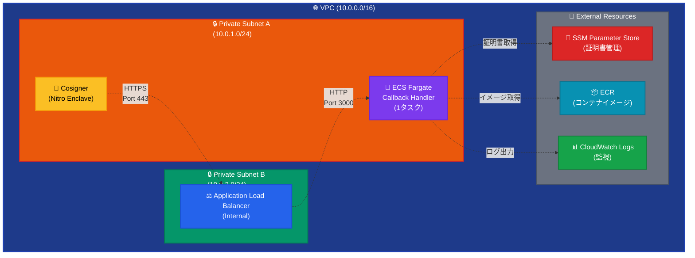
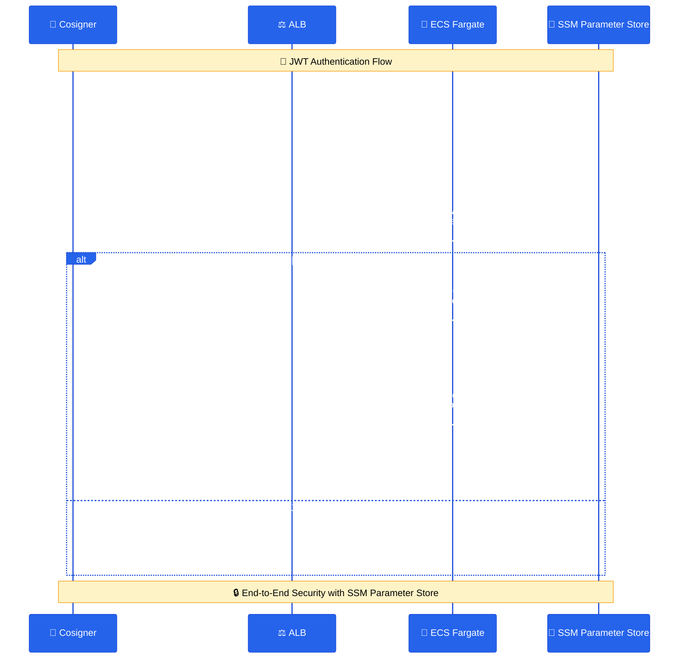

# Fireblocks Callback Handler

Fireblocks Workspace向けのCallback Handlerアプリケーションです。AWS ECS Fargate上でCosignerからのJWT署名要求をセキュアに受信・処理します。

## 📋 概要

このプロジェクトは、Fireblocks CosignerからのHTTPS接続を受け取り、JWT認証による双方向のセキュアな通信を行うCallback Handlerです。AWS ECS Fargate + Application Load Balancerの構成で、完全プライベートネットワーク内での動作を想定しています。

## 🏗️ アーキテクチャ



### 通信フロー図


## 📦 機能

- **セキュアな通信**: JWT認証による双方向の暗号化通信
- **セキュアな証明書管理**: SSM Parameter Storeによる証明書の動的取得
- **高可用性**: ECS Fargateによる自動スケーリング
- **プライベートネットワーク**: VPC内での完全分離
- **監視**: CloudWatch Logsによる詳細なログ記録
- **ヘルスチェック**: Application Load Balancerによる自動監視

## 📁 プロジェクト構造

```
fireblocks-callback-handler/
├── README.md                    # プロジェクト概要
├── .gitignore                   # Git除外設定
├── app/                         # アプリケーション
│   ├── src/                     # ソースコード
│   │   ├── app.js              # メインアプリケーション
│   │   ├── logger.js           # ログシステム
│   │   ├── jwtHandler.js       # JWT処理モジュール
│   │   └── package.json        # Node.js依存関係
│   ├── Dockerfile              # ECS Fargate用Dockerfile
│   └── certs/                  # 証明書ディレクトリ
│       ├── .gitkeep           # Git管理用空ファイル
│       ├── cosigner_public.pem # Cosigner公開鍵（要配置）
│       └── callback_private.pem # Callback秘密鍵（要配置）
├── infrastructure/             # AWS インフラストラクチャ
│   ├── cloudformation.yaml    # CloudFormationテンプレート
│   └── deploy.sh              # 自動デプロイスクリプト
├── docs/                       # ドキュメント
│   ├── deployment-guide.md     # デプロイメントガイド
│   └── aws-deployment-plan.md  # 技術仕様書
└── scripts/                    # ユーティリティスクリプト
    └── setup.sh               # 初期セットアップ
```

## 🚀 クイックスタート

### 前提条件

- AWS CLI (設定済み)
- Docker
- 適切なAWS権限

### 1. 証明書の準備

```bash
# 証明書ファイルを配置
cp cosigner_public.pem app/certs/
cp callback_private.pem app/certs/
```

**💡 証明書管理**: 証明書はデプロイメント時に自動的にSSM Parameter Storeにアップロードされ、実行時にアプリケーションが動的に取得します。コンテナイメージには証明書は含まれません。

### 2. デプロイメント実行

```bash
# デプロイメント実行（証明書自動アップロード含む）
cd infrastructure
./deploy.sh
```

**🔄 デプロイプロセス**:
1. 証明書ファイルの存在確認
2. 証明書をSSM Parameter Storeに自動アップロード
3. ECRリポジトリ作成
4. Dockerイメージビルド・プッシュ
5. CloudFormationスタック作成・更新
6. ECSサービス起動

### 3. 設定更新

デプロイメント完了後、Cosignerの設定を更新：

```json
{
  "callbackUrl": "https://callback.internal.fireblocks.com",
  "callbackCert": "",
  "callbackPublicKey": "-----BEGIN PUBLIC KEY-----\n..."
}
```

## 📖 詳細ドキュメント

- [デプロイメントガイド](docs/deployment-guide.md) - 詳細なデプロイ手順
- [技術仕様書](docs/aws-deployment-plan.md) - アーキテクチャの詳細

## 🔧 開発

### ローカル開発環境

```bash
cd app/src
npm install
node app.js
```

### Docker開発環境

```bash
cd app
docker build -f Dockerfile -t callback-handler .
docker run -p 3000:3000 callback-handler
```

## 📊 監視・運用

### ログ確認

```bash
# CloudWatch Logs
aws logs tail /ecs/callback-handler --follow --region ap-northeast-1

# エラーログ抽出
aws logs filter-log-events \
  --log-group-name /ecs/callback-handler \
  --filter-pattern "ERROR" \
  --region ap-northeast-1
```

### ヘルスチェック

```bash
# VPC内から実行
curl -k https://callback.internal.fireblocks.com/health
```

## 💰 コスト

月額約$54（東京リージョン）

- ECS Fargate (1タスク): $18
- Application Load Balancer: $20
- VPC Endpoints: $10
- Route53 Private Zone: $1
- CloudWatch Logs: $5

### 最適化効果
- 3層構成 → 2層構成: 管理の簡素化
- 2タスク → 1タスク: 約$18/月のコスト削減
- VPC Endpoints統合: 約$5/月のコスト削減

## 🔒 セキュリティ

- 完全プライベートネットワーク構成
- JWT認証による双方向検証
- VPC Endpointsによる内部通信
- 最小権限の原則

## 🤝 コントリビューション

1. フォークしてください
2. 機能ブランチを作成 (`git checkout -b feature/AmazingFeature`)
3. 変更をコミット (`git commit -m 'Add some AmazingFeature'`)
4. ブランチにプッシュ (`git push origin feature/AmazingFeature`)
5. プルリクエストを作成

## 📄 ライセンス

MIT License

## 📞 サポート

問題が発生した場合は、以下の情報を含めてIssueを作成してください：

- エラーメッセージ
- CloudWatch Logsの出力
- 実行した手順
- 環境情報

## 🔄 バージョン履歴

- **v1.1.0** - 最適化版 (現在)
  - 2層構成への最適化
  - 1タスク構成の採用
  - 約30%のコスト削減
  - 管理の簡素化

- **v1.0.0** - 初期リリース
  - ECS Fargate対応
  - プライベートネットワーク構成
  - JWT認証実装

---

**注意**: このアプリケーションは本番環境での使用を想定しています。開発環境では適切に設定を調整してください。 