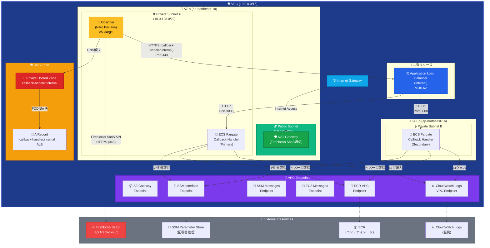
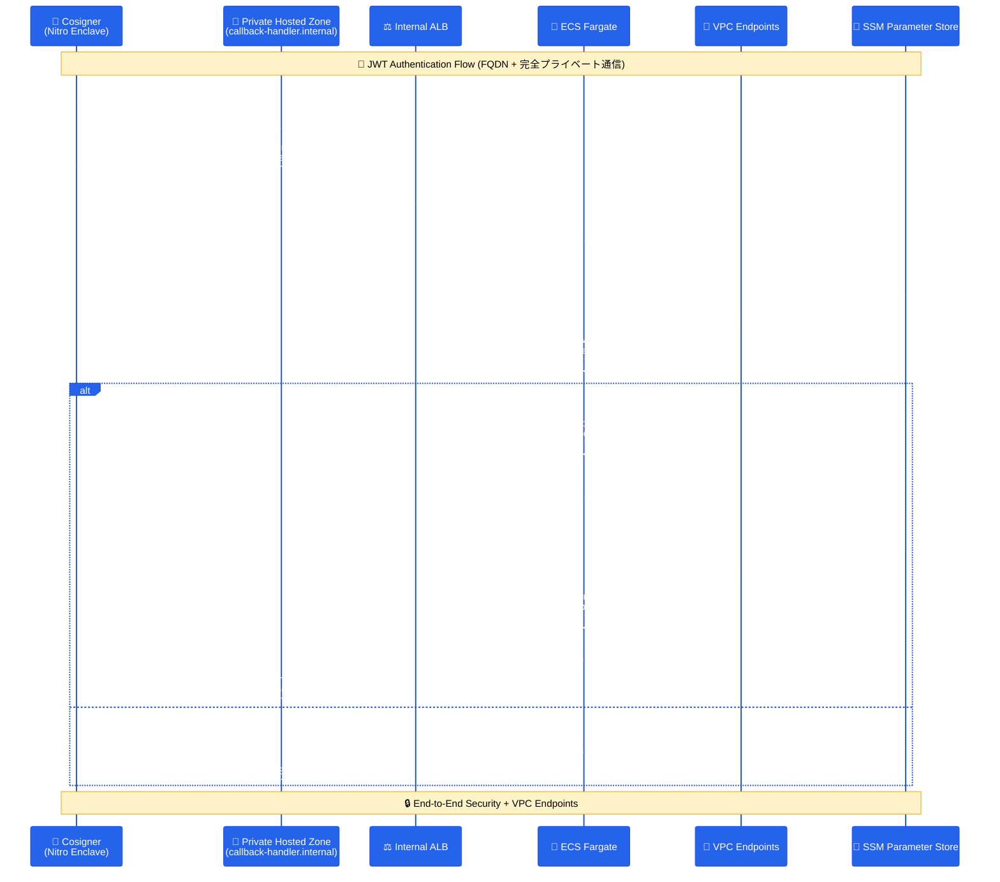

# Fireblocks Callback Handler

Fireblocks Workspace向けのCallback Handlerアプリケーションです。AWS ECS Fargate上でCosignerからのJWT署名要求をセキュアに受信・処理します。

## 📋 概要

このプロジェクトは、Fireblocks CosignerからのHTTPS接続を受け取り、JWT認証による双方向のセキュアな通信を行うCallback Handlerです。AWS ECS Fargate + Application Load Balancer + Private Hosted Zoneの構成で、完全プライベートネットワーク内でのFQDN通信を実現しています。

## 🔥 Fireblocks Cosigner統合の重要性

**Fireblocks Cosignerとは**:
- [Fireblocks公式ドキュメント](https://developers.fireblocks.com/reference/install-api-cosigner-add-new-cosigner-p2)に基づく実装
- API Cosignerは、Fireblocks SaaS (`api.fireblocks.io`) との通信が必要
- JWT-based認証によるセキュアな通信フロー
- Nitro Enclave環境でのハードウェアレベルの分離

**外部通信の必要性**:
- Cosignerは**必ず**Fireblocks SaaSとの通信が必要
- NAT Gatewayを通じた制御された外部アクセス
- 完全プライベートネットワーク内での安全な運用

## 🏗️ アーキテクチャ

### マルチAZ構成（Private Hosted Zone + 外部通信対応）


### 通信フロー図（Private Hosted Zone対応）


## 🏗️ 設計要点

### マルチスタックアーキテクチャ
このプロジェクトは、**6つの独立したCloudFormationスタック**で構成されています：

1. **Foundation Stack** (`01-foundation.yaml`) - VPC、サブネット、ルーティング
2. **Security Stack** (`02-security.yaml`) - IAM、セキュリティグループ、KMS、SSL証明書インポート
3. **DNS Stack** (`03-dns.yaml`) - Private Hosted Zone
4. **CodeBuild + ECR Automation** (`04-codebuild-automation.yaml`) - ECRリポジトリ + Dockerイメージ自動ビルド
5. **Callback Handler Stack** (`05-callback-handler.yaml`) - ALB、ECS、VPC Endpoints
6. **Cosigner Stack** (`06-cosigner.yaml`) - EC2、S3、Nitro Enclave

### ネットワーク設計
- **VPC**: 10.0.0.0/16 (完全プライベート)
- **Public Subnet**: 10.0.0.0/20 (NAT Gateway用)
- **Private Subnet A**: 10.0.128.0/20 (Cosigner + ECS)
- **Private Subnet B**: 10.0.144.0/20 (ALB + ECS)
- **マルチAZ**: 高可用性（ALB最小要件）
- **外部通信**: NAT Gateway経由でFireblocks SaaSへ制御されたアクセス

### セキュリティ設計
- **Nitro Enclave**: ハードウェアレベルの分離
- **VPC Endpoints**: 完全プライベート通信
- **KMS Customer Managed Key**: 専用暗号化
- **IAM最小権限**: 必要最小限の権限設定
- **Session Manager**: SSH鍵不要のセキュアアクセス

## 📦 機能

### JWT認証
- Cosignerからの署名付きJWT受信
- 公開鍵による署名検証
- 秘密鍵による応答JWT生成

### 証明書管理
- SSM Parameter Storeによる動的証明書取得
- KMS暗号化による保護
- VPC Endpoints経由のセキュアアクセス

### 監視・ログ
- CloudWatch Logsによる構造化ログ
- ECS Fargateメトリクス
- セキュリティイベント監視

## 📁 プロジェクト構造

```
fireblocks-callback-handler/
├── README.md                        # プロジェクト概要
├── STACK_DEPLOYMENT_GUIDE.md        # デプロイメントガイド
├── app/                             # アプリケーション
│   ├── src/                         # ソースコード
│   └── Dockerfile                   # ECS Fargate用
├── infrastructure/                  # インフラストラクチャ
│   ├── deploy-automated.sh         # 🚀 完全自動化デプロイスクリプト
│   ├── stacks/                     # CloudFormationスタック
│   │   ├── 01-foundation.yaml      # ネットワーク基盤
│   │   ├── 02-security.yaml        # セキュリティ設定 + SSL証明書インポート
│   │   ├── 03-dns.yaml             # DNS設定
│   │   ├── 04-codebuild-automation.yaml # CodeBuild + ECR自動ビルド
│   │   ├── 05-callback-handler.yaml # アプリケーション
│   │   └── 06-cosigner.yaml        # Cosigner設定
│   └── parameters/                 # パラメータファイル
│       ├── common.json             # 📝 共通設定（自動生成の基盤）
│       ├── dev/                    # 開発環境（common.jsonから自動生成）
│       └── production-jp/          # 本番環境（common.jsonから自動生成）
└── .devcontainer/                   # DevContainer設定
```

## 🚀 クイックスタート

### 方法1: 自動デプロイメント（推奨）

#### 事前準備（必須）

```bash
# DevContainerで開発環境を起動
code .
# Command Palette → "Dev Containers: Reopen in Container"

# 1. パラメータファイルを作成
./infrastructure/create-parameters.sh

# 2. 証明書ディレクトリを作成
mkdir -p certs && cd certs

# 3. JWT証明書を事前生成
# Callback Handler用の秘密鍵・公開鍵を生成
openssl genrsa -out callback_private.pem 2048
openssl rsa -in callback_private.pem -outform PEM -pubout -out callback_public.pem

# Cosigner公開鍵を配置（Fireblocks Cosignerから取得）
# Fireblocks Console または Cosignerから cosigner_public.pem を取得して配置
# cp /path/to/cosigner_public.pem ./

# 4. SSL証明書を生成（HTTPS通信用）
# シンプルな自己署名証明書を生成（ACM互換形式）
openssl req -new -x509 -keyout callback-handler-ssl.key -out callback-handler-ssl.crt \
  -days 3650 -nodes -subj "/CN=callback-handler.internal"

# 生成された証明書を確認
ls -la callback-handler-ssl.*
openssl x509 -in callback-handler-ssl.crt -text -noout | head -10

cd ..

# 5. SSL証明書をAWS Certificate Managerに手動インポート
# AWS Console → Certificate Manager → Import certificate
# または AWS CLI を使用:
aws acm import-certificate \
  --certificate fileb://certs/callback-handler-ssl.crt \
  --private-key fileb://certs/callback-handler-ssl.key \
  --profile <aws_profile> \
  --region ap-northeast-1

# 6. 証明書ARNをパラメータファイルに設定
# 上記のコマンドで出力された **CertificateArn** を、
# **`infrastructure/parameters/<ENV>/security.json`** と 
# **`infrastructure/parameters/<ENV>/callback-handler.json`** の
# `SSLCertificateArn` を **実際の ARN** に置換してください。
#   - `<ENV>` は `dev` / `staging` / `prod` など対象環境のディレクトリ名
#   - `PLACEHOLDER_SSL_CERTIFICATE_ARN` を **実際の ARN** に変更
#   - `callback-handler.json` については *ContainerImage* パラメータはスクリプトが自動更新しますが、`SSLCertificateArn` は自動更新されません
```

#### 自動デプロイメント

```bash
# JWT証明書の自動SSM登録とインフラデプロイ
./infrastructure/deploy-automated.sh -p <aws_profile>
```

**含まれる自動化**:
- 📝 **事前のパラメータファイル作成**（`./infrastructure/create-parameters.sh`）
- 🔑 JWT証明書の自動SSM Parameter Store登録
- 🏗️ CloudFormationスタックの依存関係順デプロイ
- 📦 ECRリポジトリの作成
- 🔨 CodeBuildによるDockerイメージの自動ビルド・プッシュ
- 🐳 ECS Fargateでの自動デプロイ
- 🌐 Private Hosted Zone設定
- 👤 Cosignerインフラの準備

**🚨 重要な変更点**:
- SSL証明書ARNは**事前に手動設定**が必要です
- デプロイ前に`./infrastructure/create-parameters.sh`を実行してください
- `infrastructure/parameters/<ENV>/security.json` **および** `infrastructure/parameters/<ENV>/callback-handler.json` に `PLACEHOLDER_SSL_CERTIFICATE_ARN` が残っているとデプロイが失敗します

**実行例**:
```bash
# ⚠️ 事前準備が必要（上記の事前準備手順を完了してください）

# 1. パラメータファイルを作成
./infrastructure/create-parameters.sh

# 2. SSL証明書を生成・インポート・設定（上記手順参照）

# 3. 基本的な実行
./infrastructure/deploy-automated.sh -p <aws_profile>

# 本番環境での実行
./infrastructure/deploy-automated.sh -p prod_profile -e prod

# 途中で失敗した場合の再実行（DNSスタックから）
./infrastructure/deploy-automated.sh -p <aws_profile> --from-stack dns

# 特定のスタックをスキップ（例：Cosigner）
./infrastructure/deploy-automated.sh -p <aws_profile> --skip-stacks cosigner

# ドライランで実行内容を事前確認
./infrastructure/deploy-automated.sh -p <aws_profile> --dry-run

# 現在のスタック状態を確認
./infrastructure/deploy-automated.sh -p <aws_profile> --status
```

### 🛠️ 高度なデプロイメント機能

#### 1. スタック状態の確認
```bash
# 現在のスタック状態を確認
./infrastructure/deploy-automated.sh -p <aws_profile> --status

# 出力例：
# 📊 Stack Status Summary (Environment: dev)
# =================================================
#   ✅ 1️⃣ Foundation (VPC, Subnets): CREATE_COMPLETE
#       Stack: e2e-monitor-cbh-01-foundation-dev
#   ❌ 2️⃣ Security (IAM, Security Groups): CREATE_FAILED
#       Stack: e2e-monitor-cbh-02-security-dev
#   ⚪ 3️⃣ DNS (Private Hosted Zone): Not deployed
#       Stack: e2e-monitor-cbh-03-dns-dev
#   ⚪ 4️⃣ CodeBuild + ECR: Not deployed
#       Stack: e2e-monitor-cbh-04-codebuild-dev
#   ⚪ 5️⃣ Callback Handler (ALB, ECS): Not deployed
#       Stack: e2e-monitor-cbh-05-callback-handler-dev
#   ⚪ 6️⃣ Cosigner (EC2, Nitro Enclave): Not deployed
#       Stack: e2e-monitor-cbh-06-cosigner-dev
```

#### 2. 途中からの再実行（失敗時のリベンジ）
```bash
# 特定のスタックから再開
./infrastructure/deploy-automated.sh -p <aws_profile> --from-stack dns

# 利用可能なスタック名:
# - foundation: VPC、サブネット
#   → e2e-monitor-cbh-01-foundation-dev
# - security: IAM、セキュリティグループ
#   → e2e-monitor-cbh-02-security-dev
# - dns: Private Hosted Zone
#   → e2e-monitor-cbh-03-dns-dev
# - codebuild: CodeBuild + ECR
#   → e2e-monitor-cbh-04-codebuild-dev
# - callback: Callback Handler
#   → e2e-monitor-cbh-05-callback-handler-dev
# - cosigner: Cosigner EC2
#   → e2e-monitor-cbh-06-cosigner-dev
#
# ⚠️ 注意: JWT証明書（certs/callback_private.pem, certs/cosigner_public.pem）
#          は事前に生成しておく必要があります
```

#### 3. 特定スタックのスキップ
```bash
# 単一スタックをスキップ
./infrastructure/deploy-automated.sh -p <aws_profile> --skip-stacks cosigner

# 複数スタックをスキップ（カンマ区切り）
./infrastructure/deploy-automated.sh -p <aws_profile> --skip-stacks cosigner,codebuild
```

#### 4. ドライランモード
```bash
# 実際にデプロイせずに実行内容を確認
./infrastructure/deploy-automated.sh -p <aws_profile> --dry-run

# 出力例：
# 🔍 DRY RUN MODE - No actual deployment will occur
# 🔍 [DRY RUN] Would create: Foundation Stack
#     Template: infrastructure/stacks/01-foundation.yaml
#     Parameters: infrastructure/parameters/dev/foundation.json
```

#### 5. 環境別・地域別デプロイメント
```bash
# 開発環境（デフォルト）
./infrastructure/deploy-automated.sh -p dev_profile

# ステージング環境
./infrastructure/deploy-automated.sh -p staging_profile -e staging

# 本番環境
./infrastructure/deploy-automated.sh -p prod_profile -e prod

# 異なるリージョンにデプロイ
./infrastructure/deploy-automated.sh -p my_profile -r us-east-1
```

#### 6. 設定のカスタマイズ
`infrastructure/parameters/common.json`を編集して、プロジェクト固有の設定を変更できます：

```json
{
  "ProjectName": "my-fireblocks-cbh",
  "Region": "ap-northeast-1",
  "Environment": "dev",
  "NetworkConfig": {
    "VpcCidr": "10.0.0.0/16",
    "PublicSubnetCidr": "10.0.0.0/20",
    "PrivateSubnetCidr": "10.0.128.0/20"
  },
  "DomainConfig": {
    "InternalDomain": "callback-handler.internal"
  }
}
```

**設定項目の説明**:
- **ProjectName**: プロジェクト名（リソース名の接頭辞）
- **Region**: AWSリージョン
- **Environment**: 環境名（dev/staging/prod）
- **NetworkConfig**: ネットワーク設定
  - **VpcCidr**: VPCのCIDRブロック
  - **PublicSubnetCidr**: パブリックサブネットのCIDRブロック
  - **PrivateSubnetCidr**: プライベートサブネットのCIDRブロック
- **DomainConfig**: ドメイン設定
  - **InternalDomain**: 内部ドメイン名

**🔄 設定変更時の注意**:
- `common.json`を変更後、デプロイメントを実行すると全パラメータファイルが自動的に再生成されます
- **SSL証明書ARNは手動設定値が保持されます**（上書きされません）
- ネットワーク設定を変更する場合は、既存のリソースとの整合性を確認してください

### 🔧 トラブルシューティング

#### よくある失敗パターンと対処法

1. **JWT証明書が見つからない（デプロイ前エラー）**
   ```bash
   # JWT証明書を生成してから再実行
   mkdir -p certs && cd certs
   openssl genrsa -out callback_private.pem 2048
   openssl rsa -in callback_private.pem -outform PEM -pubout -out callback_public.pem
   # cosigner_public.pem を Fireblocks から取得して配置
   cd .. && ./infrastructure/deploy-automated.sh -p <aws_profile>
   ```

2. **CodeBuildでのイメージビルド失敗**
   ```bash
   # CodeBuildスタックから再実行
   ./infrastructure/deploy-automated.sh -p <aws_profile> --from-stack codebuild
   ```

4. **Callback Handlerでのコンテナ起動失敗**
   ```bash
   # Callback Handlerスタックから再実行
   ./infrastructure/deploy-automated.sh -p <aws_profile> --from-stack callback
   ```

5. **Cosignerが不要な場合**
   ```bash
   # Cosignerをスキップしてデプロイ
   ./infrastructure/deploy-automated.sh -p <aws_profile> --skip-stacks cosigner
   ```

#### エラー時の状態確認
```bash
# 詳細な状態確認
./infrastructure/deploy-automated.sh -p <aws_profile> --status

# JWT証明書ファイルの確認
ls -la certs/
# 以下のファイルが必要:
# - callback_private.pem  (自動生成)
# - callback_public.pem   (自動生成)
# - cosigner_public.pem   (Fireblocks から取得)

# SSM Parameter Store の確認
aws ssm get-parameters \
    --names "/e2e-monitor-cbh/dev/jwt/callback-private-key" \
           "/e2e-monitor-cbh/dev/jwt/cosigner-public-key" \
    --region ap-northeast-1 \
    --profile <aws_profile> \
    --query 'Parameters[].Name'

# AWS コンソールでの確認
# 1. CloudFormation スタックの詳細
# 2. CloudWatch Logs でのログ確認
# 3. ECS サービスの状態確認
# 4. SSM Parameter Store での証明書確認
```

### 5. Cosignerの手動設定

インフラストラクチャのデプロイ完了後、Cosignerの設定を手動で実施：

```bash
# Cosignerインスタンスへのアクセス（Session Manager経由）
# インスタンスIDは AWS Console または CLI で確認
aws ssm start-session --target i-xxxxxxxxx --region ap-northeast-1

# Cosignerソフトウェアのインストール
sudo yum update -y
# Fireblocks提供のCosignerインストール手順に従う

# ペアリングトークンの設定
# Fireblocks Console から取得したペアリングトークンを使用
```

## 💰 コスト

### 月額推定コスト（東京リージョン）
- **ECS Fargate**: $18
- **Application Load Balancer**: $20
- **Cosigner EC2 (c5.xlarge)**: $35
- **NAT Gateway**: $32
- **VPC Endpoints**: $16
- **その他**: $10

**合計**: 約$131/月

### コスト最適化
- Spot Instance使用で約50%削減
- 予約インスタンスで長期運用コスト削減
- Auto Scalingによる需要調整

## 🔒 セキュリティ

### セキュリティ機能
- **Nitro Enclave**: ハードウェアレベルの分離
- **KMS暗号化**: 専用Customer Managed Key
- **VPC Endpoints**: 完全プライベート通信
- **IAM最小権限**: 必要最小限の権限
- **Session Manager**: SSH鍵不要のアクセス

### 監視・監査
- **CloudWatch Alarms**: 異常検知
- **CloudTrail**: API操作監査
- **Security Hub**: セキュリティ状況
- **AWS Config**: 設定変更監視

## 🔄 バージョン履歴

- **v2.0.0** - マルチスタック対応版（現在）
  - 5スタック構成
  - マルチAZ対応
  - Nitro Enclave対応
  - Private Hosted Zone対応
  - セキュリティ強化

- **v1.0.0** - 初期リリース
  - ECS Fargate対応
  - JWT認証実装

## 🛡️ 実運用における重要なポイント

### 外部通信要件
- CosignerはFireblocks SaaS (`api.fireblocks.io`) との通信が必須
- NAT Gateway経由の制御されたアクセス
- セキュリティグループによる最小権限通信

### デプロイメント時の確認事項
1. VPC CIDR設定 (10.0.0.0/16)
2. マルチAZ構成
3. Private Hosted Zone設定
4. 証明書の適切な配置
5. 環境別パラメータファイル設定

---

## ✅ デプロイ後の確認事項

### 📊 システム動作確認

**完全自動化デプロイメント後、以下の確認を行ってください**：

1. **ECS サービス動作確認** - Fargate タスクが正常に起動しているか
2. **JWT証明書読み込み確認** - CloudWatch Logs でSSM Parameter Store からの証明書読み込み
3. **ALB Health Check** - Application Load Balancer のヘルスチェック状態
4. **DNS 解決確認** - Private Hosted Zone での名前解決

### 🔑 証明書管理

- **SSL証明書**: 🔧 **手動インポート** (事前生成 → 手動ACMインポート → パラメータファイル設定)
- **JWT証明書**: ✅ **SSM 自動登録** (事前生成 → 自動SSM登録)

### 📖 参考資料

詳細な設定については、各CloudFormationスタックファイルを参照してください。 

- [Fireblocks API Cosigner ドキュメント](https://developers.fireblocks.com/reference/install-api-cosigner-add-new-cosigner-p2)
- [AWS ECS Fargate ドキュメント](https://docs.aws.amazon.com/ecs/latest/userguide/AWS_Fargate.html)
- [AWS SSM Parameter Store](https://docs.aws.amazon.com/systems-manager/latest/userguide/systems-manager-parameter-store.html) 