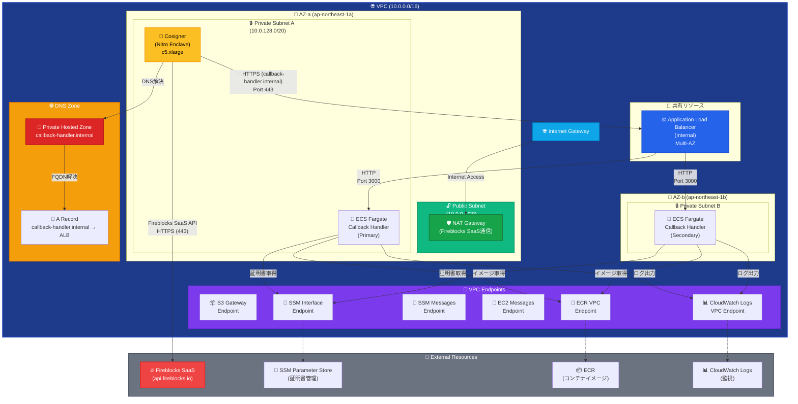
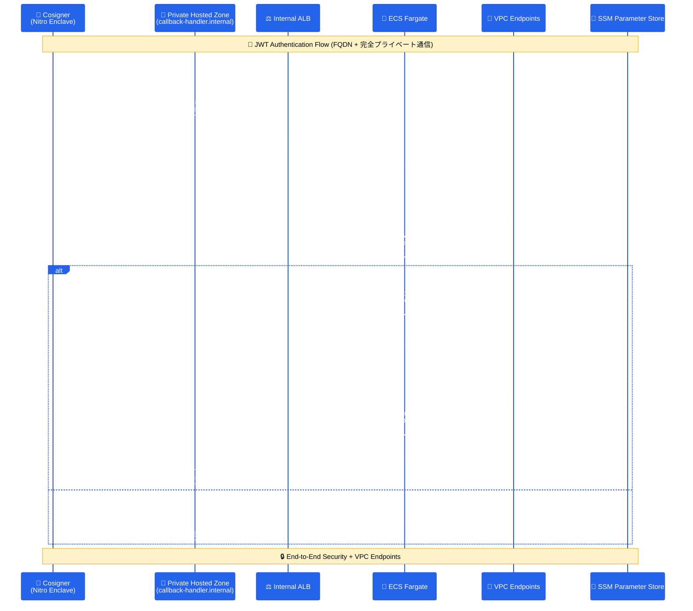

# Fireblocks Callback Handler

Fireblocks Workspace向けのCallback Handlerアプリケーションです。AWS ECS Fargate上でCosignerからのJWT署名要求をセキュアに受信・処理します。

## 📋 概要

このプロジェクトは、Fireblocks CosignerからのHTTPS接続を受け取り、JWT認証による双方向のセキュアな通信を行うCallback Handlerです。AWS ECS Fargate + Application Load Balancer + Private Hosted Zoneの構成で、完全プライベートネットワーク内でのFQDN通信を実現しています。

## 🔥 Fireblocks Cosigner統合の重要性

**Fireblocks Cosignerとは**:
- [Fireblocks公式ドキュメント](https://developers.fireblocks.com/reference/install-api-cosigner-add-new-cosigner-p2)に基づく実装
- API Cosignerは、Fireblocks SaaS (`api.fireblocks.io`) との通信が必要
- JWT-based認証によるセキュアな通信フロー
- Nitro Enclave環境でのハードウェアレベルの分離

**外部通信の必要性**:
- Cosignerは**必ず**Fireblocks SaaSとの通信が必要
- NAT Gatewayを通じた制御された外部アクセス
- 完全プライベートネットワーク内での安全な運用

## 🏗️ アーキテクチャ

### マルチAZ構成（Private Hosted Zone + 外部通信対応）


### 通信フロー図（Private Hosted Zone対応）


## 🏗️ 設計要点

### マルチスタックアーキテクチャ
このプロジェクトは、**5つの独立したCloudFormationスタック**で構成されています：

1. **Foundation Stack** (`01-foundation.yaml`) - VPC、サブネット、ルーティング
2. **Security Stack** (`02-security.yaml`) - IAM、セキュリティグループ、KMS
3. **DNS Stack** (`03-dns.yaml`) - Private Hosted Zone
4. **Callback Handler Stack** (`04-callback-handler.yaml`) - ALB、ECS、VPC Endpoints
5. **Cosigner Stack** (`05-cosigner.yaml`) - EC2、S3、Nitro Enclave

### ネットワーク設計
- **VPC**: 10.0.0.0/16 (完全プライベート)
- **Public Subnet**: 10.0.0.0/20 (NAT Gateway用)
- **Private Subnet A**: 10.0.128.0/20 (Cosigner + ECS)
- **Private Subnet B**: 10.0.144.0/20 (ALB + ECS)
- **マルチAZ**: 高可用性（ALB最小要件）
- **外部通信**: NAT Gateway経由でFireblocks SaaSへ制御されたアクセス

### セキュリティ設計
- **Nitro Enclave**: ハードウェアレベルの分離
- **VPC Endpoints**: 完全プライベート通信
- **KMS Customer Managed Key**: 専用暗号化
- **IAM最小権限**: 必要最小限の権限設定
- **Session Manager**: SSH鍵不要のセキュアアクセス

## 📦 機能

### JWT認証
- Cosignerからの署名付きJWT受信
- 公開鍵による署名検証
- 秘密鍵による応答JWT生成

### 証明書管理
- SSM Parameter Storeによる動的証明書取得
- KMS暗号化による保護
- VPC Endpoints経由のセキュアアクセス

### 監視・ログ
- CloudWatch Logsによる構造化ログ
- ECS Fargateメトリクス
- セキュリティイベント監視

## 📁 プロジェクト構造

```
fireblocks-callback-handler/
├── README.md                        # プロジェクト概要
├── STACK_DEPLOYMENT_GUIDE.md        # デプロイメントガイド
├── app/                             # アプリケーション
│   ├── src/                         # ソースコード
│   └── Dockerfile                   # ECS Fargate用
├── infrastructure/                  # インフラストラクチャ
│   ├── deploy-stacks.sh            # 統合デプロイスクリプト
│   ├── stacks/                     # CloudFormationスタック
│   │   ├── 01-foundation.yaml      # ネットワーク基盤
│   │   ├── 02-security.yaml        # セキュリティ設定
│   │   ├── 03-dns.yaml             # DNS設定
│   │   ├── 04-callback-handler.yaml # アプリケーション
│   │   └── 05-cosigner.yaml        # Cosigner設定
│   └── parameters/                 # パラメータファイル
│       ├── common.json             # 共通設定
│       ├── dev/                    # 開発環境
│       └── production-jp/          # 本番環境
└── .devcontainer/                   # DevContainer設定
```

## 🚀 クイックスタート

### 1. 開発環境のセットアップ

```bash
# DevContainerで開発環境を起動
code .
# Command Palette → "Dev Containers: Reopen in Container"
```

### 2. 証明書の準備

```bash
# 証明書ファイルを配置
cp cosigner_public.pem certs/
cp callback_private.pem certs/
```

### 3. SSL証明書の作成

```bash
# certsディレクトリでSSL証明書を作成
cd certs

# プライベートドメイン用の自己署名証明書を作成（10年間有効）
openssl req -x509 -newkey rsa:2048 -keyout callback-handler-ssl.key -out callback-handler-ssl.crt -days 3650 -nodes -subj "/C=US/ST=CA/L=San Francisco/O=Fireblocks/CN=callback-handler.internal"

# ACMに証明書をインポート
aws acm import-certificate \
    --certificate fileb://callback-handler-ssl.crt \
    --private-key fileb://callback-handler-ssl.key \
    --region ap-northeast-1 \
    --profile ****

# 証明書ARNを取得（後で使用）
aws acm list-certificates --region ap-northeast-1 --profile ****

# プロジェクトルートに戻る
cd ..
```

### 4. 設定ファイルの準備

```bash
# パラメータファイルを作成
./infrastructure/deploy-stacks.sh create-params

# 作成されたパラメータファイルを編集
# infrastructure/parameters/dev/callback-handler.json
# - ContainerImage: 実際のECRイメージURIに置換（必要に応じて）

# infrastructure/parameters/dev/cosigner.json
# - 基本的なパラメータ（ProjectName, Environment, InstanceType）のみ
# - CosignerのペアリングトークンやインストールはEC2起動後に手動設定
```

### 5. マルチスタックデプロイメント

```bash
# 現在のスタック状態を確認
./infrastructure/deploy-stacks.sh status

# AWS認証情報の設定確認
aws configure list --profile ****

# 全スタックのデプロイ（開発環境）
./infrastructure/deploy-stacks.sh deploy-all

# 本番環境でのデプロイ（環境指定）
./infrastructure/deploy-stacks.sh deploy-all -e production-jp

# 個別スタックのデプロイ（依存関係順）
./infrastructure/deploy-stacks.sh deploy-foundation
./infrastructure/deploy-stacks.sh deploy-security
./infrastructure/deploy-stacks.sh deploy-dns
./infrastructure/deploy-stacks.sh deploy-callback
./infrastructure/deploy-stacks.sh deploy-cosigner

# パラメータファイルの作成（初回のみ）
./infrastructure/deploy-stacks.sh create-params

# ヘルプの表示
./infrastructure/deploy-stacks.sh help
```

**重要**: 
- 初回デプロイ前に SSL証明書をACMに作成・インポート
- `create-params` でパラメータファイルを作成
- 依存関係があるため、個別デプロイ時は順序を守る
- Cosignerの設定（ペアリングトークン、インストール）はEC2起動後に手動で実施

詳細なデプロイメント手順については、**[STACK_DEPLOYMENT_GUIDE.md](STACK_DEPLOYMENT_GUIDE.md)**を参照してください。

### 6. Cosignerの手動設定

インフラストラクチャのデプロイ完了後、Cosignerの設定を手動で実施：

```bash
# Cosignerインスタンスへのアクセス（Session Manager経由）
# インスタンスIDは AWS Console または CLI で確認
aws ssm start-session --target i-xxxxxxxxx --region ap-northeast-1

# Cosignerソフトウェアのインストール
sudo yum update -y
# Fireblocks提供のCosignerインストール手順に従う

# ペアリングトークンの設定
# Fireblocks Console から取得したペアリングトークンを使用
```

## 💰 コスト

### 月額推定コスト（東京リージョン）
- **ECS Fargate**: $18
- **Application Load Balancer**: $20
- **Cosigner EC2 (c5.xlarge)**: $35
- **NAT Gateway**: $32
- **VPC Endpoints**: $16
- **その他**: $10

**合計**: 約$131/月

### コスト最適化
- Spot Instance使用で約50%削減
- 予約インスタンスで長期運用コスト削減
- Auto Scalingによる需要調整

## 🔒 セキュリティ

### セキュリティ機能
- **Nitro Enclave**: ハードウェアレベルの分離
- **KMS暗号化**: 専用Customer Managed Key
- **VPC Endpoints**: 完全プライベート通信
- **IAM最小権限**: 必要最小限の権限
- **Session Manager**: SSH鍵不要のアクセス

### 監視・監査
- **CloudWatch Alarms**: 異常検知
- **CloudTrail**: API操作監査
- **Security Hub**: セキュリティ状況
- **AWS Config**: 設定変更監視

## 🔄 バージョン履歴

- **v2.0.0** - マルチスタック対応版（現在）
  - 5スタック構成
  - マルチAZ対応
  - Nitro Enclave対応
  - Private Hosted Zone対応
  - セキュリティ強化

- **v1.0.0** - 初期リリース
  - ECS Fargate対応
  - JWT認証実装

## 🛡️ 実運用における重要なポイント

### 外部通信要件
- CosignerはFireblocks SaaS (`api.fireblocks.io`) との通信が必須
- NAT Gateway経由の制御されたアクセス
- セキュリティグループによる最小権限通信

### デプロイメント時の確認事項
1. VPC CIDR設定 (10.0.0.0/16)
2. マルチAZ構成
3. Private Hosted Zone設定
4. 証明書の適切な配置
5. 環境別パラメータファイル設定

---

詳細な設定については、各CloudFormationスタックファイルを参照してください。 