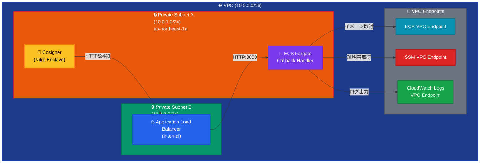

# AWS Callback Handler Deployment Plan

## ネットワーク構成

### ネットワーク構成図


### VPC構成
```yaml
VPC:
  CIDR: 10.0.0.0/16
  
Subnets:
  PrivateSubnetA:
    CIDR: 10.0.1.0/24
    AZ: ap-northeast-1a
    Purpose: Cosigner + ECS Fargate
    
  PrivateSubnetB:
    CIDR: 10.0.2.0/24
    AZ: ap-northeast-1c
    Purpose: ALB Multi-AZ
```

### Security Groups
```yaml
CosignerSecurityGroup:
  Egress:
    - Protocol: HTTPS
      Port: 443
      Destination: ALBSecurityGroup
      
ALBSecurityGroup:
  Ingress:
    - Protocol: HTTPS
      Port: 443
      CidrIp: 10.0.0.0/16
  Egress:
    - Protocol: HTTP
      Port: 3000
      Destination: ECSSecurityGroup
      
ECSSecurityGroup:
  Ingress:
    - Protocol: HTTP
      Port: 3000
      Source: ALBSecurityGroup
  Egress:
    - Protocol: ALL
      Destination: 0.0.0.0/0
      Description: Access to VPC Endpoints and external services
```

## ECS Fargate設定

### クラスター設定
```yaml
ECSCluster:
  Name: fireblocks-callback-cluster
  CapacityProviders:
    - FARGATE
```

### タスク定義
```yaml
TaskDefinition:
  Family: callback-handler
  NetworkMode: awsvpc
  RequiresCompatibilities:
    - FARGATE
  CPU: 256
  Memory: 512
  ExecutionRoleArn: !Ref ECSTaskExecutionRole
  TaskRoleArn: !Ref ECSTaskRole
  
  ContainerDefinitions:
    - Name: callback-handler
      Image: !Sub ${AWS::AccountId}.dkr.ecr.${AWS::Region}.amazonaws.com/fireblocks-callback:latest
      Essential: true
      Memory: 512
      PortMappings:
        - ContainerPort: 3000
          Protocol: tcp
      LogConfiguration:
        LogDriver: awslogs
        Options:
          awslogs-group: !Ref CloudWatchLogGroup
          awslogs-region: !Ref AWS::Region
          awslogs-stream-prefix: callback-handler
      Environment:
        - Name: NODE_ENV
          Value: production
        - Name: PORT
          Value: "3000"
```

### サービス設定
```yaml
ECSService:
  ServiceName: callback-handler-service
  Cluster: !Ref ECSCluster
  TaskDefinition: !Ref TaskDefinition
  DesiredCount: 1
  LaunchType: FARGATE
  NetworkConfiguration:
    AwsvpcConfiguration:
      SecurityGroups:
        - !Ref ECSSecurityGroup
      Subnets:
        - !Ref PrivateSubnetA
      AssignPublicIp: DISABLED
  LoadBalancers:
    - ContainerName: callback-handler
      ContainerPort: 3000
      TargetGroupArn: !Ref TargetGroup
```

## Load Balancer設定

### Application Load Balancer
```yaml
ApplicationLoadBalancer:
  Type: application
  Scheme: internal
  SecurityGroups:
    - !Ref ALBSecurityGroup
  Subnets:
    - !Ref PrivateSubnetA
    - !Ref PrivateSubnetB
  Tags:
    - Key: Name
      Value: fireblocks-callback-alb

TargetGroup:
  Type: ip
  Port: 3000
  Protocol: HTTP
  VpcId: !Ref VPC
  HealthCheckPath: /health
  HealthCheckProtocol: HTTP
  HealthCheckIntervalSeconds: 30
  HealthyThresholdCount: 2
  UnhealthyThresholdCount: 3

Listener:
  Port: 443
  Protocol: HTTPS
  DefaultActions:
    - Type: forward
      TargetGroupArn: !Ref TargetGroup
  Certificates:
    - CertificateArn: !Ref SSLCertificate
```

## VPC Endpoints

### ECR VPC Endpoint
```yaml
ECRVPCEndpoint:
  VpcId: !Ref VPC
  ServiceName: !Sub com.amazonaws.${AWS::Region}.ecr.dkr
  VpcEndpointType: Interface
  SubnetIds:
    - !Ref PrivateSubnetA
  SecurityGroupIds:
    - !Ref VPCEndpointSecurityGroup
    
ECRAPIVPCEndpoint:
  VpcId: !Ref VPC
  ServiceName: !Sub com.amazonaws.${AWS::Region}.ecr.api
  VpcEndpointType: Interface
  SubnetIds:
    - !Ref PrivateSubnetA
  SecurityGroupIds:
    - !Ref VPCEndpointSecurityGroup
```

### CloudWatch Logs VPC Endpoint
```yaml
CloudWatchLogsVPCEndpoint:
  VpcId: !Ref VPC
  ServiceName: !Sub com.amazonaws.${AWS::Region}.logs
  VpcEndpointType: Interface
  SubnetIds:
    - !Ref PrivateSubnetA
  SecurityGroupIds:
    - !Ref VPCEndpointSecurityGroup
```

### S3 VPC Endpoint
```yaml
S3VPCEndpoint:
  VpcId: !Ref VPC
  ServiceName: !Sub com.amazonaws.${AWS::Region}.s3
  VpcEndpointType: Gateway
  RouteTableIds:
    - !Ref PrivateRouteTable
```

## IAM Role設定

### ECS Task Execution Role
```yaml
ECSTaskExecutionRole:
  AssumeRolePolicyDocument:
    Statement:
      - Effect: Allow
        Principal:
          Service: ecs-tasks.amazonaws.com
        Action: sts:AssumeRole
  ManagedPolicyArns:
    - arn:aws:iam::aws:policy/service-role/AmazonECSTaskExecutionRolePolicy
  Policies:
    - PolicyName: ECRAccessPolicy
      PolicyDocument:
        Statement:
          - Effect: Allow
            Action:
              - ecr:GetAuthorizationToken
              - ecr:BatchCheckLayerAvailability
              - ecr:GetDownloadUrlForLayer
              - ecr:BatchGetImage
            Resource: "*"
```

### ECS Task Role
```yaml
ECSTaskRole:
  AssumeRolePolicyDocument:
    Statement:
      - Effect: Allow
        Principal:
          Service: ecs-tasks.amazonaws.com
        Action: sts:AssumeRole
  Policies:
    - PolicyName: CloudWatchLogsPolicy
      PolicyDocument:
        Statement:
          - Effect: Allow
            Action:
              - logs:CreateLogStream
              - logs:PutLogEvents
            Resource: !Sub ${CloudWatchLogGroup}:*
```

## 証明書管理

### SSL証明書 (ALB用)
```yaml
IAMSSLCertificate:
  Type: AWS::IAM::ServerCertificate
  Properties:
    ServerCertificateName: !Sub '${AWS::StackName}-ssl-cert'
    CertificateBody: !Ref SSLCertificateBody
    PrivateKey: !Ref SSLPrivateKey
    Path: /
```

### JWT証明書 (SSM Parameter Store)
```yaml
# デプロイメントスクリプトで自動的に設定
Parameters:
  - Name: /{StackName}/callback-private-key
    Type: SecureString
    Description: Callback Handler Private Key for JWT signing
    
  - Name: /{StackName}/cosigner-public-key
    Type: SecureString
    Description: Cosigner Public Key for JWT verification
```

### Route53 Private Hosted Zone
```yaml
PrivateHostedZone:
  Name: internal.mtools.web3sst.com
  VPCs:
    - VPCId: !Ref VPC
      VPCRegion: !Ref AWS::Region
      
DNSRecord:
  Type: A
  Name: callback.internal.mtools.web3sst.com
  HostedZoneId: !Ref PrivateHostedZone
  AliasTarget:
    DNSName: !GetAtt ApplicationLoadBalancer.DNSName
    HostedZoneId: !GetAtt ApplicationLoadBalancer.CanonicalHostedZoneID
```

## 監視・ログ設定

### CloudWatch Log Group
```yaml
CloudWatchLogGroup:
  LogGroupName: /ecs/callback-handler
  RetentionInDays: 7
```

### CloudWatch Alarms
```yaml
HighCPUAlarm:
  MetricName: CPUUtilization
  Namespace: AWS/ECS
  Statistic: Average
  Period: 300
  EvaluationPeriods: 2
  Threshold: 80
  ComparisonOperator: GreaterThanThreshold
  
HighMemoryAlarm:
  MetricName: MemoryUtilization
  Namespace: AWS/ECS
  Statistic: Average
  Period: 300
  EvaluationPeriods: 2
  Threshold: 80
  ComparisonOperator: GreaterThanThreshold
```

## デプロイメント手順

### 1. ECRリポジトリ作成
```bash
aws ecr create-repository --repository-name fireblocks-callback --region ap-northeast-1
```

### 2. Dockerイメージビルド・プッシュ
```bash
# ECRにログイン
aws ecr get-login-password --region ap-northeast-1 | docker login --username AWS --password-stdin <account-id>.dkr.ecr.ap-northeast-1.amazonaws.com

# イメージビルド
cd app
docker build -f Dockerfile -t fireblocks-callback .

# タグ付け
docker tag fireblocks-callback:latest <account-id>.dkr.ecr.ap-northeast-1.amazonaws.com/fireblocks-callback:latest

# プッシュ
docker push <account-id>.dkr.ecr.ap-northeast-1.amazonaws.com/fireblocks-callback:latest
```

### 3. CloudFormationテンプレート適用
```bash
cd infrastructure
aws cloudformation deploy \
  --template-file cloudformation.yaml \
  --stack-name fireblocks-callback-infrastructure \
  --parameter-overrides ContainerImage=<account-id>.dkr.ecr.ap-northeast-1.amazonaws.com/fireblocks-callback:latest \
  --capabilities CAPABILITY_IAM \
  --region ap-northeast-1
```

### 4. 自動デプロイ実行
```bash
# 証明書配置
cp cosigner_public.pem app/certs/
cp callback_private.pem app/certs/

# デプロイ実行（証明書自動アップロード含む）
cd infrastructure
./deploy.sh
```

**💡 デプロイプロセス**:
1. 証明書ファイルの存在確認
2. 証明書をSSM Parameter Storeに自動アップロード
3. ECRリポジトリ作成
4. Dockerイメージビルド・プッシュ
5. CloudFormationスタック作成・更新
6. ECSサービス起動

## 動作確認

### 1. サービス状態確認
```bash
aws ecs describe-services \
  --cluster fireblocks-callback-cluster \
  --services callback-handler-service \
  --region ap-northeast-1
```

### 2. ヘルスチェック
```bash
curl -k https://callback.internal.fireblocks.com/health
```

### 3. ログ確認
```bash
aws logs tail /ecs/callback-handler --follow --region ap-northeast-1
```

## コスト想定

### 月間コスト（東京リージョン）
- **ECS Fargate (1タスク)**: 約$18/月
- **Application Load Balancer**: 約$20/月
- **VPC Endpoints**: 約$10/月
- **Route53 Private Zone**: 約$1/月
- **CloudWatch Logs**: 約$5/月
- **ACM証明書**: 無料

**合計**: 約$54/月

## 最適化ポイント

### 1. 2層構成の採用
- **3層構成** → **2層構成** (コスト削減)
- **2タスク** → **1タスク** (コスト削減)
- **3つのサブネット** → **2つのサブネット** (管理の簡素化)

### 2. 一蓮托生の考慮
- CosignerとCallback Handlerの相互依存関係を考慮
- 冗長化によるコスト増加を回避
- 障害時の影響範囲を最小化

### 3. Multi-AZ要件の維持
- ALBの高可用性要件を満たす
- 単一AZ障害時の継続動作を確保

## セキュリティ考慮事項

1. **ネットワーク分離**: 完全プライベート構成
2. **最小権限の原則**: IAMロールで必要最小限の権限
3. **暗号化**: 通信はHTTPS/TLSで暗号化
4. **監査**: CloudTrailでAPI呼び出しを記録
5. **ログ**: アプリケーションログをCloudWatchに集約

## トラブルシューティング

### よくある問題と解決策

#### 問題1: ECSタスクが起動しない
```bash
# タスクの詳細確認
aws ecs describe-tasks \
  --cluster fireblocks-callback-cluster \
  --tasks $(aws ecs list-tasks \
    --cluster fireblocks-callback-cluster \
    --service-name callback-handler-service \
    --query 'taskArns[0]' \
    --output text) \
  --region ap-northeast-1
```

#### 問題2: 証明書エラー
```bash
# SSM Parameter Storeの証明書確認
aws ssm get-parameter \
  --name "/fireblocks-callback-infrastructure/callback-private-key" \
  --with-decryption \
  --region ap-northeast-1 \
  --query 'Parameter.Value' \
  --output text

aws ssm get-parameter \
  --name "/fireblocks-callback-infrastructure/cosigner-public-key" \
  --with-decryption \
  --region ap-northeast-1 \
  --query 'Parameter.Value' \
  --output text
  --region ap-northeast-1
```

#### 問題3: ネットワーク接続エラー
```bash
# セキュリティグループの確認
aws ec2 describe-security-groups \
  --group-ids sg-xxxxx \
  --region ap-northeast-1

# ターゲットグループの確認
aws elbv2 describe-target-health \
  --target-group-arn arn:aws:elasticloadbalancing:ap-northeast-1:xxxx:targetgroup/callback-handler-tg/xxxxx \
  --region ap-northeast-1
```

## アップデート手順

### アプリケーションの更新
```bash
# 新しいイメージをビルド・プッシュ
./deploy.sh

# 自動的にECSサービスが新しいバージョンにアップデート
```

### 設定の変更
```bash
# CloudFormationテンプレートを更新
cd infrastructure
aws cloudformation deploy \
  --template-file cloudformation.yaml \
  --stack-name fireblocks-callback-infrastructure \
  --parameter-overrides ContainerImage=$ACCOUNT_ID.dkr.ecr.ap-northeast-1.amazonaws.com/fireblocks-callback:latest \
  --capabilities CAPABILITY_IAM \
  --region ap-northeast-1
```

## リソース削除

```bash
# CloudFormationスタック削除
aws cloudformation delete-stack \
  --stack-name fireblocks-callback-infrastructure \
  --region ap-northeast-1

# ECRリポジトリ削除
aws ecr delete-repository \
  --repository-name fireblocks-callback \
  --force \
  --region ap-northeast-1
```

## サポート

問題が発生した場合は、以下の情報を含めてお問い合わせください：

1. エラーメッセージ
2. CloudWatch Logsの出力
3. ECSタスクの詳細
4. 実行した手順

---

**注意**: この設計は1タスク構成の最適化版です。本番環境での使用を想定しています。 