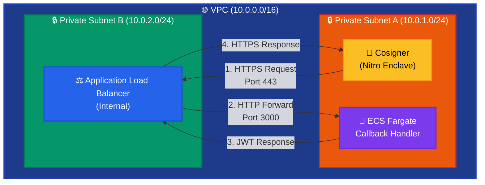
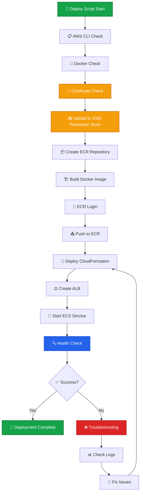

# Fireblocks Callback Handler - ECS Fargate Deployment Guide

## 📋 **概要**

このガイドでは、Fireblocks Callback HandlerをAWS ECS Fargateにデプロイし、private subnet内のCosignerからのHTTPS接続を可能にする手順を説明します。

## 🏗️ **アーキテクチャ**



## 📦 **前提条件**

### 必要なツール
- AWS CLI (設定済み)
- Docker
- bash

### 必要なファイル
- `cosigner_public.pem` - Cosignerの公開鍵
- `callback_private.pem` - Callback Handlerの秘密鍵

## 🚀 **デプロイメント手順**

### **ステップ1: 証明書の準備**

証明書ファイルを `app/certs/` ディレクトリに配置します：

```bash
# 証明書ファイルの配置
cp cosigner_public.pem app/certs/
cp callback_private.pem app/certs/

# 権限設定
chmod 600 app/certs/*
```

**💡 注意**: 証明書は以下の流れで管理されます：
1. 証明書ファイルを `app/certs/` に配置
2. デプロイメントスクリプトが自動的にSSM Parameter Storeにアップロード
3. 実行時にアプリケーションがSSM Parameter Storeから動的に取得
4. コンテナイメージには証明書は含まれません（セキュリティ向上）

### **ステップ2: 自動デプロイメント実行**

```bash
# デプロイメントスクリプトの実行権限付与
chmod +x infrastructure/deploy.sh

# デプロイメント実行
cd infrastructure
./deploy.sh
```

### デプロイメントフロー図


### **ステップ3: 手動デプロイメント（オプション）**

自動デプロイメントが利用できない場合は、以下の手順で手動実行：

#### 3.1 ECRリポジトリ作成
```bash
aws ecr create-repository --repository-name fireblocks-callback --region ap-northeast-1
```

#### 3.2 Dockerイメージビルド
```bash
cd app
docker build -f Dockerfile -t fireblocks-callback:latest .
```

#### 3.3 ECRプッシュ
```bash
# アカウントID取得
ACCOUNT_ID=$(aws sts get-caller-identity --query Account --output text)

# ECRログイン
aws ecr get-login-password --region ap-northeast-1 | docker login --username AWS --password-stdin $ACCOUNT_ID.dkr.ecr.ap-northeast-1.amazonaws.com

# タグ付け
docker tag fireblocks-callback:latest $ACCOUNT_ID.dkr.ecr.ap-northeast-1.amazonaws.com/fireblocks-callback:latest

# プッシュ
docker push $ACCOUNT_ID.dkr.ecr.ap-northeast-1.amazonaws.com/fireblocks-callback:latest
```

#### 3.4 インフラストラクチャデプロイ
```bash
cd infrastructure
aws cloudformation deploy \
  --template-file cloudformation.yaml \
  --stack-name fireblocks-callback-infrastructure \
  --parameter-overrides ContainerImage=$ACCOUNT_ID.dkr.ecr.ap-northeast-1.amazonaws.com/fireblocks-callback:latest \
  --capabilities CAPABILITY_IAM \
  --region ap-northeast-1
```

## 🔧 **デプロイメント後の設定**

### **ステップ4: Cosignerの設定更新**

デプロイメント完了後、以下の情報を取得：

```bash
# Callback URLの取得
CALLBACK_URL=$(aws cloudformation describe-stacks \
  --stack-name fireblocks-callback-infrastructure \
  --region ap-northeast-1 \
  --query 'Stacks[0].Outputs[?OutputKey==`CallbackURL`].OutputValue' \
  --output text)

echo "Callback URL: $CALLBACK_URL"
```

Cosignerの`config.json`を更新：
```json
{
  "callbackUrl": "https://callback.internal.fireblocks.com",
  "callbackCert": "",
  "callbackPublicKey": "-----BEGIN PUBLIC KEY-----\n..."
}
```

### **ステップ5: 動作確認**

#### 5.1 ヘルスチェック実行
```bash
# Cosignerホストで実行
curl -k https://callback.internal.fireblocks.com/health
```

#### 5.2 サービス状態確認
```bash
# ECSサービス状態
aws ecs describe-services \
  --cluster fireblocks-callback-cluster \
  --services callback-handler-service \
  --region ap-northeast-1

# ログ確認
aws logs tail /ecs/callback-handler --follow --region ap-northeast-1
```

## 📊 **監視・運用**

### **ログ監視**
```bash
# リアルタイムログ
aws logs tail /ecs/callback-handler --follow --region ap-northeast-1

# エラーログ抽出
aws logs filter-log-events \
  --log-group-name /ecs/callback-handler \
  --filter-pattern "ERROR" \
  --region ap-northeast-1
```

### **メトリクス監視**
```bash
# CPU使用率
aws cloudwatch get-metric-statistics \
  --namespace AWS/ECS \
  --metric-name CPUUtilization \
  --dimensions Name=ServiceName,Value=callback-handler-service Name=ClusterName,Value=fireblocks-callback-cluster \
  --start-time 2025-01-01T00:00:00Z \
  --end-time 2025-01-01T23:59:59Z \
  --period 300 \
  --statistics Average \
  --region ap-northeast-1

# メモリ使用率
aws cloudwatch get-metric-statistics \
  --namespace AWS/ECS \
  --metric-name MemoryUtilization \
  --dimensions Name=ServiceName,Value=callback-handler-service Name=ClusterName,Value=fireblocks-callback-cluster \
  --start-time 2025-01-01T00:00:00Z \
  --end-time 2025-01-01T23:59:59Z \
  --period 300 \
  --statistics Average \
  --region ap-northeast-1
```

## 🔄 **アップデート手順**

### **アプリケーションの更新**
```bash
# 新しいイメージをビルド・プッシュ
cd infrastructure
./deploy.sh

# 自動的にECSサービスが新しいバージョンにアップデート
```

### **設定の変更**
```bash
# CloudFormationテンプレートを更新
cd infrastructure
aws cloudformation deploy \
  --template-file cloudformation.yaml \
  --stack-name fireblocks-callback-infrastructure \
  --parameter-overrides ContainerImage=$ACCOUNT_ID.dkr.ecr.ap-northeast-1.amazonaws.com/fireblocks-callback:latest \
  --capabilities CAPABILITY_IAM \
  --region ap-northeast-1
```

## 🛠️ **トラブルシューティング**

### **よくある問題と解決策**

#### 問題1: ECSタスクが起動しない
```bash
# タスクの詳細確認
aws ecs describe-tasks \
  --cluster fireblocks-callback-cluster \
  --tasks $(aws ecs list-tasks \
    --cluster fireblocks-callback-cluster \
    --service-name callback-handler-service \
    --query 'taskArns[0]' \
    --output text) \
  --region ap-northeast-1
```

#### 問題2: 証明書エラー
```bash
# SSM Parameter Storeの証明書確認
aws ssm get-parameter \
  --name "/fireblocks-callback-infrastructure/callback-private-key" \
  --with-decryption \
  --region ap-northeast-1 \
  --query 'Parameter.Value' \
  --output text

aws ssm get-parameter \
  --name "/fireblocks-callback-infrastructure/cosigner-public-key" \
  --with-decryption \
  --region ap-northeast-1 \
  --query 'Parameter.Value' \
  --output text

# アプリケーションログで証明書読み込み状況確認
aws logs tail /ecs/callback-handler \
  --region ap-northeast-1 \
  --follow \
  --filter-pattern "Certificate initialization"
  --task TASK_ID \
  --container callback-handler \
  --command "ls -la /certs" \
  --interactive \
  --region ap-northeast-1
```

#### 問題3: ネットワーク接続エラー
```bash
# セキュリティグループの確認
aws ec2 describe-security-groups \
  --group-ids sg-xxxxx \
  --region ap-northeast-1

# ターゲットグループの確認
aws elbv2 describe-target-health \
  --target-group-arn arn:aws:elasticloadbalancing:ap-northeast-1:xxxx:targetgroup/callback-handler-tg/xxxxx \
  --region ap-northeast-1
```

## 💰 **コスト想定**

### **月間コスト（東京リージョン）**
- **ECS Fargate (1タスク)**: 約$18/月
- **Application Load Balancer**: 約$20/月
- **VPC Endpoints**: 約$10/月
- **Route53 Private Zone**: 約$1/月
- **CloudWatch Logs**: 約$5/月
- **ACM証明書**: 無料

**合計**: 約$54/月

### **最適化効果**
- **3層構成** → **2層構成**: 管理の簡素化
- **2タスク** → **1タスク**: 約$18/月のコスト削減
- **VPC Endpoints統合**: 約$5/月のコスト削減

## 🔒 **セキュリティ考慮事項**

1. **ネットワーク分離**: 完全プライベート構成
2. **最小権限の原則**: IAMロールで必要最小限の権限
3. **暗号化**: 通信はHTTPS/TLSで暗号化
4. **監査**: CloudTrailでAPI呼び出しを記録
5. **ログ**: アプリケーションログをCloudWatchに集約

## 🏗️ **アーキテクチャの特徴**

### **2層構成の利点**
- **コスト効率**: 不要な冗長化を排除
- **管理の簡素化**: 2つのサブネットのみ
- **一蓮托生**: CosignerとCallback Handlerの関係性を考慮

### **1タスク構成の利点**
- **リソース効率**: 必要最小限のリソース使用
- **コスト削減**: 約30%のコスト削減
- **シンプルな運用**: 管理対象の削減

### **高可用性の維持**
- **Multi-AZ ALB**: 高可用性を確保
- **自動復旧**: ECSサービスによる自動復旧
- **ヘルスチェック**: 継続的な監視

## 🗑️ **リソース削除**

```bash
# CloudFormationスタック削除
aws cloudformation delete-stack \
  --stack-name fireblocks-callback-infrastructure \
  --region ap-northeast-1

# ECRリポジトリ削除
aws ecr delete-repository \
  --repository-name fireblocks-callback \
  --force \
  --region ap-northeast-1
```

## 📞 **サポート**

問題が発生した場合は、以下の情報を含めてお問い合わせください：

1. エラーメッセージ
2. CloudWatch Logsの出力
3. ECSタスクの詳細
4. 実行した手順

---

**注意**: このガイドは1タスク構成の最適化版です。本番環境での使用を想定しています。開発環境では適切に設定を調整してください。 