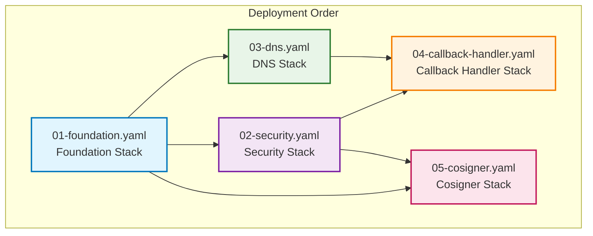
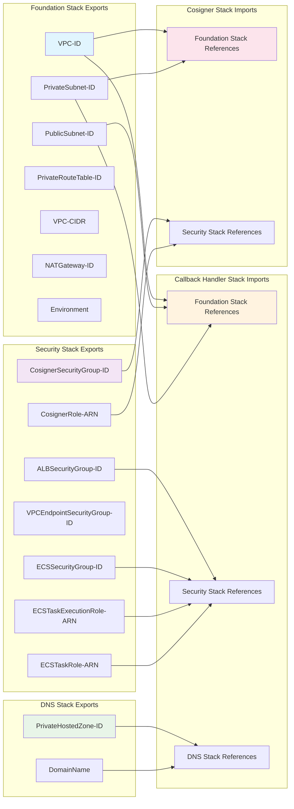

# CloudFormation Stack Architecture

## 📊 スタック依存関係図

## 🏗️ スタック別リソース一覧

### Foundation Stack (基盤)
| Resource Type | Resource Name | Purpose |
|---------------|---------------|---------|
| AWS::EC2::VPC | VPC | メインVPC |
| AWS::EC2::Subnet | PublicSubnet | NAT Gateway用パブリックサブネット |
| AWS::EC2::Subnet | PrivateSubnet | アプリケーション用プライベートサブネット |
| AWS::EC2::InternetGateway | InternetGateway | インターネットアクセス |
| AWS::EC2::NatGateway | NATGateway | プライベートサブネットからの外部通信 |
| AWS::EC2::RouteTable | PublicRouteTable | パブリックルートテーブル |
| AWS::EC2::RouteTable | PrivateRouteTable | プライベートルートテーブル |
| AWS::EC2::EIP | NATGatewayEIP | NAT Gateway用Elastic IP |

### Security Stack (セキュリティ)
| Resource Type | Resource Name | Purpose |
|---------------|---------------|---------|
| AWS::EC2::SecurityGroup | CosignerSecurityGroup | Cosigner用セキュリティグループ |
| AWS::EC2::SecurityGroup | ALBSecurityGroup | ALB用セキュリティグループ |
| AWS::EC2::SecurityGroup | ECSSecurityGroup | ECS用セキュリティグループ |
| AWS::EC2::SecurityGroup | VPCEndpointSecurityGroup | VPCエンドポイント用セキュリティグループ |
| AWS::EC2::VPCEndpoint | S3GatewayEndpoint | S3用VPCエンドポイント |
| AWS::EC2::VPCEndpoint | SSMEndpoint | SSM用VPCエンドポイント |
| AWS::EC2::VPCEndpoint | ECREndpoint | ECR用VPCエンドポイント |
| AWS::EC2::VPCEndpoint | CloudWatchLogsEndpoint | CloudWatch Logs用VPCエンドポイント |
| AWS::IAM::Role | CosignerRole | Cosigner用IAMロール |
| AWS::IAM::Role | ECSTaskExecutionRole | ECS Task Execution用IAMロール |
| AWS::IAM::Role | ECSTaskRole | ECS Task用IAMロール |

### DNS Stack (DNS)
| Resource Type | Resource Name | Purpose |
|---------------|---------------|---------|
| AWS::Route53::HostedZone | PrivateHostedZone | プライベートホストゾーン |

### Callback Handler Stack (コールバックハンドラー)
| Resource Type | Resource Name | Purpose |
|---------------|---------------|---------|
| AWS::ECS::Cluster | ECSCluster | ECSクラスター |
| AWS::ECS::TaskDefinition | ECSTaskDefinition | ECSタスク定義 |
| AWS::ECS::Service | ECSService | ECSサービス |
| AWS::ElasticLoadBalancingV2::LoadBalancer | ApplicationLoadBalancer | アプリケーションロードバランサー |
| AWS::ElasticLoadBalancingV2::TargetGroup | TargetGroup | ALB用ターゲットグループ |
| AWS::ElasticLoadBalancingV2::Listener | ALBListener | ALBリスナー |
| AWS::Route53::RecordSet | ALBDNSRecord | ALB用DNSレコード |
| AWS::Logs::LogGroup | LogGroup | CloudWatch Logsグループ |
| AWS::CloudWatch::Alarm | HighCPUAlarm | CPU使用率アラーム |
| AWS::CloudWatch::Alarm | HighMemoryAlarm | メモリ使用率アラーム |

### Cosigner Stack (Cosigner)
| Resource Type | Resource Name | Purpose |
|---------------|---------------|---------|
| AWS::EC2::Instance | CosignerInstance | Cosigner用EC2インスタンス |
| AWS::Logs::LogGroup | CosignerLogGroup | Cosigner用CloudWatch Logsグループ |
| AWS::SSM::Parameter | CloudWatchAgentConfig | CloudWatch Agent設定 |
| AWS::SSM::Parameter | CosignerInstallationScriptParam | Cosignerインストールスクリプト |
| AWS::SSM::Parameter | CosignerPairingTokenParam | Cosignerペアリングトークン |
| AWS::CloudWatch::Alarm | HighCPUAlarm | CPU使用率アラーム |
| AWS::CloudWatch::Alarm | HighMemoryAlarm | メモリ使用率アラーム |
| AWS::CloudWatch::Alarm | StatusCheckAlarm | ステータスチェックアラーム |

## 🔗 Cross-Stack References

### Export/Import 関係

## 🚀 デプロイメント順序

### 1. Foundation Stack
- **順序**: 1番目
- **依存関係**: なし
- **所要時間**: 約5-10分

### 2. Security Stack
- **順序**: 2番目
- **依存関係**: Foundation Stack
- **所要時間**: 約10-15分（VPCエンドポイント作成により）

### 3. DNS Stack
- **順序**: 3番目
- **依存関係**: Foundation Stack
- **所要時間**: 約2-3分

### 4. Callback Handler Stack
- **順序**: 4番目
- **依存関係**: Foundation Stack, Security Stack, DNS Stack
- **所要時間**: 約15-20分（ECSサービス起動により）

### 5. Cosigner Stack
- **順序**: 5番目
- **依存関係**: Foundation Stack, Security Stack
- **所要時間**: 約10-15分（EC2インスタンス起動により）

## 🔄 更新戦略

### 影響範囲マトリックス

| Stack | Foundation | Security | DNS | Callback Handler | Cosigner |
|-------|------------|----------|-----|------------------|----------|
| Foundation | ✅ | ⚠️ | ⚠️ | ⚠️ | ⚠️ |
| Security | ❌ | ✅ | ❌ | ⚠️ | ⚠️ |
| DNS | ❌ | ❌ | ✅ | ⚠️ | ❌ |
| Callback Handler | ❌ | ❌ | ❌ | ✅ | ❌ |
| Cosigner | ❌ | ❌ | ❌ | ❌ | ✅ |

**凡例:**
- ✅ 更新可能
- ⚠️ 慎重に更新（依存関係を考慮）
- ❌ 更新不可（依存関係により）

### 推奨更新順序

1. **アプリケーション更新**: Callback Handler Stack → Cosigner Stack
2. **セキュリティ更新**: Security Stack → Callback Handler Stack → Cosigner Stack
3. **インフラ更新**: Foundation Stack → Security Stack → DNS Stack → Callback Handler Stack → Cosigner Stack

## 🎯 Best Practices

### 1. スタック設計原則
- **単一責任**: 各スタックは単一の責任を持つ
- **疎結合**: スタック間の依存関係を最小化
- **再利用性**: 異なる環境で再利用可能

### 2. 運用上の考慮事項
- **バックアップ**: 重要なデータはバックアップを取る
- **監視**: 各スタックの状態を監視
- **ログ**: 十分なログを残す

### 3. セキュリティ
- **最小権限**: 必要最小限の権限のみ付与
- **暗号化**: 保存時および転送時の暗号化
- **監査**: 全ての変更を記録

---

**注意**: このマルチスタック構成により、各コンポーネントの独立したライフサイクル管理が可能になり、システムの保守性、拡張性、セキュリティが大幅に向上します。 